```{r setup, include=FALSE}
library(reticulate)
use_python("/usr/local/bin/python3", required = TRUE)

knitr::opts_chunk$set(echo = TRUE, cache = FALSE)
```

Not currently included:

- 0xHell - analyzer.py provides the source code, but reproducible results were not found.
- stopdihode - repository with source code appears to be private
- vintageplayer - no public source code found

# mohamad1371

looking into the dataset of GR1-GR12 we may wonder why some of the grants recieve thousands of dollars of crowd_fund while some others really recieve nothing. why contributers showed more interest to some grants? is there any relationship between the category of grants and the attention it recieved?

in this work, we are going to find answers for this kind of questions
let's dive in.


```{python}
import pandas as pd

data = pd.read_csv('Grants Results History Round over Round + Grant over Grant - GR1-GR12.csv')
```

in the first step we plot the number of grants(rows) for each round:

```{python}
import seaborn as sns
import matplotlib.pyplot as plt

plt.figure(figsize=(8,6))
sns.countplot(data.round_number)
plt.ylabel('number of grants')
```

as we can see, the overall trend in number of grants is ascending. only in GR7 and GR8 this trend is a bit different, which may be because of the large growth in GR6 (compared with GR5). between GR7-GR11 the ascending trend is moderate and the growth is slow. but in GR12 again there is a huge growth (compared with GR11). this large growth (106%) is awesome, but keeping the ascending trend  after this round is going to be harder.

the other important data is the number of grants with 0 or 1 unique contributer. let's plot this number for each round:

```{python}
zero_one_c = data[data['num_unique_contributors'] <=1]
plt.figure(figsize=(18,6))
sns.countplot(zero_one_c.round_number)
plt.ylabel('number of grants with 0 or 1 contributor ')
```

based on this graph, in GR6 and GR12 there is a large number of grants which did not have any contributer (or just 1). specifically in GR12 there are 1034 grants of all 1813, with 0 or 1 contributer. this means that 57% of the grants in GR12 are not supported!!! this value was about 3.8% for GR11. so what happened in GR12? why many grants remained unsupported? this is so important because may cause people be unmotivated for the next rounds.
i did not find an good statistical answer for this questions. but one reason maybe the large number of grants in GR12. the other reason maybe the quality of this projects and how much these projects are valuable for contributers. and the last thing may be the good social media team which plays a significant role in helping people be familiar with grants. 

---

another worth mentioning thing is the category of grants. if we know what categories are more important for contributers, we will have better vision. so, in order to have a better sense, we can use the parameter of the number of unique contributers and plot its distribution by category. 
first of all we should clean data and then plot the pie chart:

```{python}
data['match_amount'] = data['match_amount'].str.replace(',', '').str.replace('$', '').astype(float)
data['crowdfund_amount_contributions_usd'] = data['crowdfund_amount_contributions_usd'].str.replace(',', '').str.replace('$', '').astype(float)

data12 = data[data['round_number'] == 12]
```

distribution of unique contribtions for each category(GR1-GR12): 

```{python, results='hide'}
g_b = data.groupby("category")['num_unique_contributors'].sum()

pie, ax = plt.subplots(figsize=[15,15])
labels = g_b.keys()

plt.pie(x=g_b, autopct="%.1f%%", labels=labels, pctdistance=0.9)
plt.title("unique contributions per category(GR1-GR12)", fontsize=18);
pie.savefig("unique_contributions_per_category.png")
```

```{r}
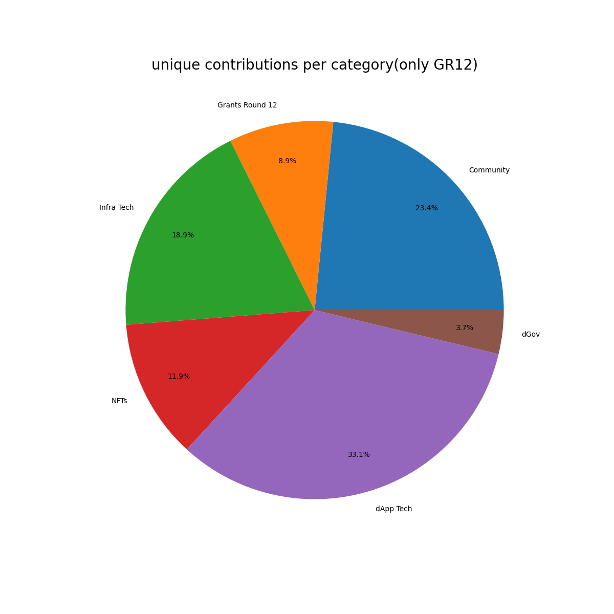
```

distribution of unique contribtions for each category(only GR12):

```{python, results='hide'}
g_b = data12.groupby("category")['num_unique_contributors'].sum()

pie, ax = plt.subplots(figsize=[12,12])
labels = g_b.keys()

plt.pie(x=g_b, autopct="%.1f%%", labels=labels, pctdistance=0.8)
plt.title("unique contributions per category(only GR12)", fontsize=20);
pie.savefig("unique_contributions_per_category.png")
```

```{r}

```

as we can see in both graphs, this 3 categories have the most unique contributers in all rounds:


*    dAPP Tech
*    community
*   Infra Tech

in GR12 we can see less diversity in categories but those 3 categories still have the most contributers.

---

we can also plot the distribution of crowd funding in each category to compare the result with the last two graphs.
so we plot crowdfund amount contributions by category
(GR1-GR12):

```{python, results='hide'}
g_b = data.groupby("category")['crowdfund_amount_contributions_usd'].sum()

pie, ax = plt.subplots(figsize=[15,15])
labels = g_b.keys()

plt.pie(x=g_b, autopct="%.1f%%", labels=labels, pctdistance=0.8)
plt.title("crowdfund amount per category(GR1-GR12)", fontsize=20);
pie.savefig("crowdfund_amount_per_category.png")
```

```{r}
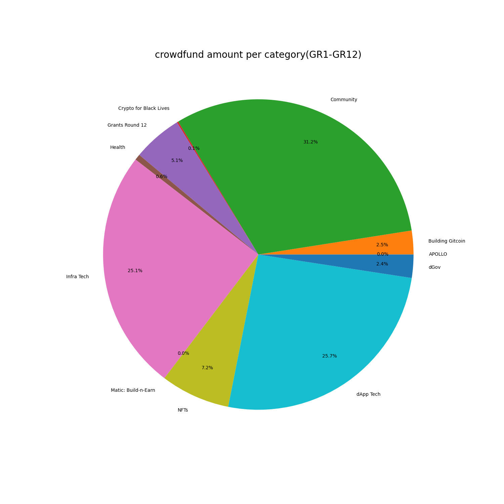
```

we can see that still those 3 categories are in Top. just the order of them changes a bit:


*   community
*   dAPP Tech
*    Infra Tech

from this graph and previous 2 graphs, we can conclude that contributers have more tendency to fund in dAPP Tech, community and Infra Tech categories.**But** is it the whole story? let's go into some more details and  plot the pie chart of the number of grants in each category from GR1 to GR12.

```{python, results='hide'}
g_b = data.groupby(['category']).size()
pie, ax = plt.subplots(figsize=[16,16])
labels = g_b.keys()
plt.pie(x=g_b, autopct="%.1f%%", labels=labels, pctdistance=0.7)
plt.title("number of grants category(GR1-GR12)", fontsize=20);
pie.savefig("num_grants_per_category.png")
```

```{r}
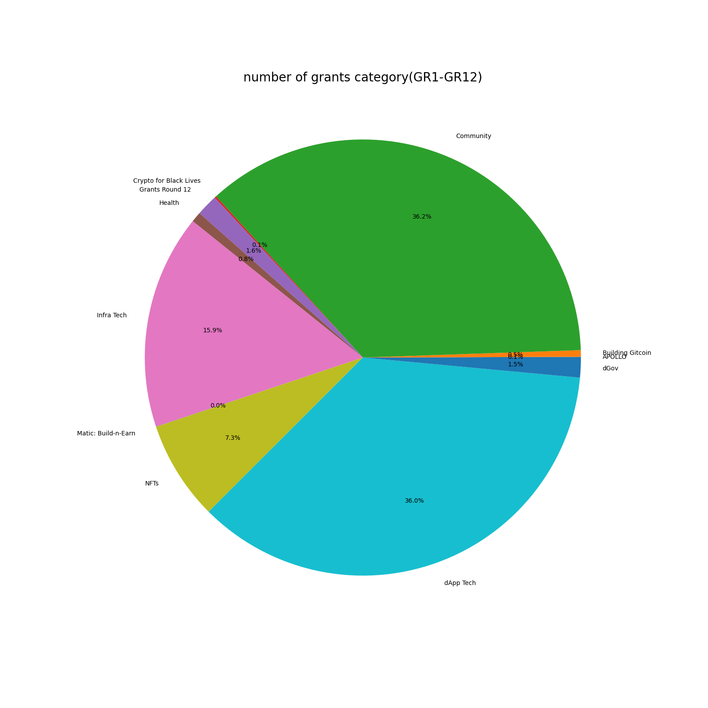
```

we see that the community, dAPP Tech and Infra Tech are still in top. comparing this result with last 3 graphs, we can say that the number of contributions and crowd_funds is high for this 3 categories **because these are the most categories which the contributers could see in the rounds**. this is a better justification and makes sense.

---


so far we discussed the number of grants each round, grants with 0 or 1 contributers and the popularity of categories. now let's talk about the regions. we can plot the distribution of grants by region:


```{python}
plt.figure(figsize=(18,6))
sns.countplot(data.region)
plt.ylabel('number of grants')
```

as we can see, most of grants are from north america and europe, and many of them are undefined or none. but one question:

**Question:** is there any relationship between the region of each grant and the number of contributions it recieved? 

this question can be asked because people **may have unintentionally** bias in favor of some regions and this can be the cause of more contributions to that grants. so let's go in more statistical details.
to answer this question we should compare the distribution of contributions by region with the distribution of grants by region and see if they are similar or not.
so, first we plot the distribution of contributions by region:

```{python, results='hide'}
g_b = data.groupby("region")['num_contributions'].sum()

pie, ax = plt.subplots(figsize=[16,16])
labels = g_b.keys()

plt.pie(x=g_b, autopct="%.1f%%", labels=labels, pctdistance=0.9)
plt.title("contributions to each region(GR1-GR12)", fontsize=20);
pie.savefig("contributions_to_regions.png")
```

```{r}
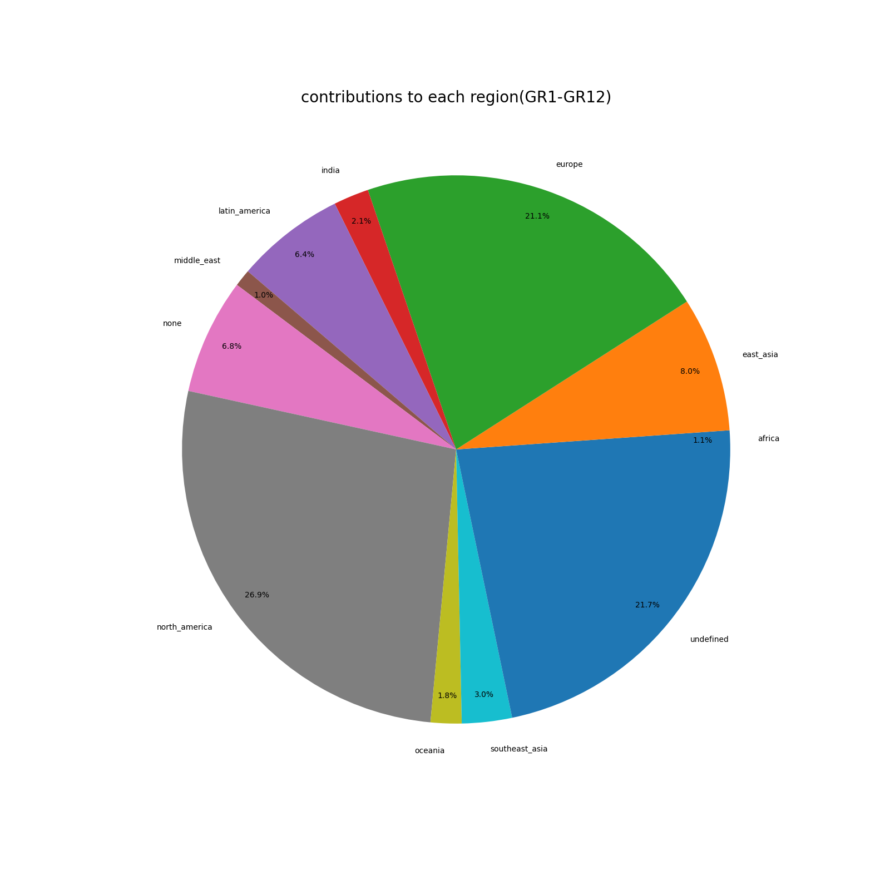
```

and also we need the pie chart of distribution of grants by regions:

```{python, results='hide'}
g_b = data.groupby(['region']).size()

pie, ax = plt.subplots(figsize=[16,16])
labels = g_b.keys()

plt.pie(x=g_b, autopct="%.1f%%", labels=labels, pctdistance=0.9)
plt.title("distribution of grants over regions(GR1-GR12)", fontsize=20);
pie.savefig("distribution_to_regions.png")
```

```{r}
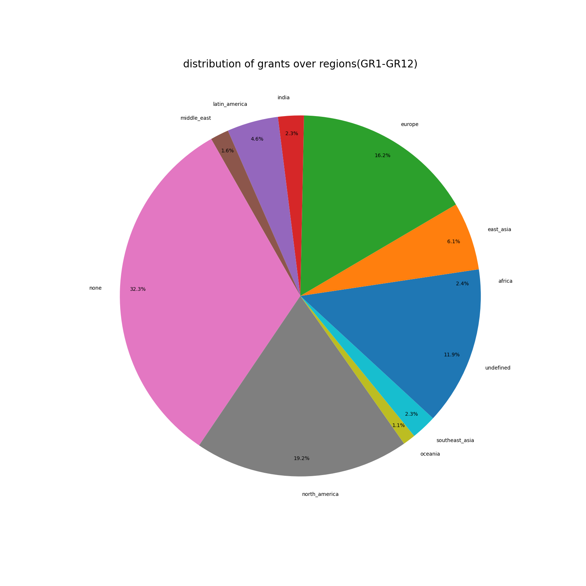
```

as we can see in both graphs, north america, europe and east asia are at the Top and the percents are almost similar. so, this means that there isn't any bias.** the number of contributions are high for this regions because the majarity of grants are from this regions.** 


---

our first question still remains: why some grants recieve more attention and contributions?
we saw that the category and the regoin of the grants are possibly not determining factors. so, it's worth considering to investigate the top grants and see what are they proposing and what are they talking about.
one good way of doing this, is to find the Mega words of this grants. so, we can use the "about" section of their site(or anything similar) and find this words.

```{python}
top_num_uniq = data.sort_values('num_unique_contributors', ascending=False).head(5)

aax = top_num_uniq.plot.bar(x='grant_id', y='num_unique_contributors', rot=0, figsize=(18,6))
```

the first grant which recieved the most unique contributions, with grant_id = 3133:

```{python}
from wordcloud import WordCloud, STOPWORDS, ImageColorGenerator

text = ''' Li.Finance is a mesh of aggregated cross-chain bridges and protocols to power next-gen DeFi projects with superior UX by making liquidity available when needed.

For starters: „Think of LiFi as a 1inch for cross-chain liquidity networks (Connext, Hop, Thorchain, Anyswap, Ren, RouterProtocol, etc..)“

Our Thesis
The Future is multi chain with Ethereum being the biggest player
Cross-chain bridging solutions will play a major role in future DeFi-Enablement and Layer 2 adoption
Aggregation will pave the way for mass adoption of layer 2 and the multi-chain environment we'll live in, benefitting the whole ecosystem.

Problem
The problem comes in three ways:
Protocols like Connext and Hop are focusing on bridging liquidity between EVM based chains and layer 2 scaling solutions, while Thorchain, Anyswap and others are focusing on bridging to different layer 1s. They all need to fill large liquidity pools and come at different levels of speed, security and trust. It will also take a lot of time for them to get up to speed supporting true any-to-any swaps across chains.
Users always need to find a way to get their funds from A to B and have almost no clarity about which solution or bridge to take. 
Dapp developers are suffering from a lot of communication overhead, trying to teach their users how to use their products and which bridges to take. A lot of friction and reduced conversion rates.

Solution
A data mesh of cross-chain liquidity sources: networks, DEXes and liquidity providers:
Aggregate cross-chain liquidity pools like Connext, Hop, RouterProtocol, Thorchain, Chainflip, Anyswap, etc. and make sure to always know their liquidity pools
On top of that, connect to all DEXes and DEX aggregators like 1inch on all chains to be able to to facilitate any-to-any swaps
For arbitrageurs and the impatient user, allow to connect to lending protocols on spot.
All of this will not only be made available as a dapp, but also as a widget for other dapp developers, so that users won't have to leave dapps anymore in order to get their funds to where they need it.

Team
Max and Philipp have been working together for over 8 years, spent 6 years bootstrapping stomt.com and developed over 30 thirdparty integrations, a highly scalable web platform, APIs and cross-platform mobile apps. Philipp did business development in >14 countries and was frequently booked as speaker. 

March

Launched 10k-lazy minting NFT project on Ethereum
1 prize at NFTHack ETHGlobal Hackathon
April 

Hired/Onboarded our first additional developer
4 prizes at ScalingEthereum ETHGlobal Hackathon
May

3 prizes at Web3 ETHGlobal Hackathon
Joined KERNEL Block III
June

1st speaking slot at crypto summit
$50.000 Grant from Connext
July

Started switching to NXTP (Connext new protocol)
August

Helped the Connext team to launch xpollinate.io v2

Why do we need this grant?

We've already onboarded one developer to crypto and through years of experience we have access to a lot of other developers whom we trust and like to onboard. For that we need to be able to pay them. Our project is huge and will take a longer time to get built, secured and optimized.

Why should you invest in this?

LiFinance will have an immediate impact on future dapps, layer 2 scaling adoption and DeFi summer 2.0

LiFinance will power the official interface of Connext

An experienced team that shares a lot of trust and entrepreneurial spirit

Are you also fundraising?

Yes, soon. We're currently finishing the HackMoney hackathon and apply for a couple of grants. After that we'll start fundraising from business angels and protocol founders. People who we think can make a difference through knowledge, network or integration of our widget.'''

norm_msg_cloud = WordCloud(width =520, height =260, max_font_size=50,
                          background_color ="black", colormap='Blues').generate(text)

plt.figure(figsize=(16,10))
plt.imshow(norm_msg_cloud, interpolation='bilinear')
plt.axis('off') # turn off axis
plt.show()
```

as we can see this grant is mostly talking about this topics:

- Connext
- liquidity
- Thorchain
- dapp

2nd grant with grant_id = 490 :

```{python}

text = ''' t's been a busy quarter for POAP. We worked very hard and minted thousands of tokens, making lots of people happy on the way. We are always happy to receive your support, not only in funding but also in words of appreciation and help communicating our spirit. Thanks ! 
Hey everyone! 

We’re excited to announce our first ever Gitcoin Grant application.
If you’ve yet to experience some POAP magic - you may recall receiving an NFT badge at one of the many Ethereum events we’ve been blessed to partner with. Some highlights (in a visually appealing order) include:

EthCC (Paris, France)
Devcon (Osaka, Japan)
Dappcon (Berlin, Germany)
EthDenver (Colorado, USA)
EthGlobal (Waterloo, Boston, Bangalore, London, etc)

What is POAP?

POAP - short for Proof of Attendance Protocol - provides event nomads with a way to verify their attendance through collecting digital badges, all of which live onchain. Each badge is unique, meaning that the only way to claim one is to physically (or digitally) receive it at the event.

For those of you who love to flex all the Ethereum events you’ve attended over the past year, POAP is your ticket for ultimate crypto clout.

It seems like people like to flex, as we’ve distributed roughly 7000 badges across more than 60 coveted events.

Why Gitcoin Grants?

While our journey has been incredible, what you might not know is that the entire project has been volunteer oriented, meaning we’ve funded everything - both time and money - in house. We’ve turned down ETH Killers and other avenues which we felt tarnished the purity of what we’re looking to build.

This means that everything from gas cost wars to travel, distribution and dealing with Japanese customs accusing us of smuggling drugs has been out of pocket due to our love for Ethereum and the wider community. 

We’ve been lucky enough to work with and receive support from Ethereum’s best and brightest talents, all of which are highlighted in POAP’s journey since its creation at ETHDenver in 2019.

While we're extremely saddened by the fact that all of our events where we planned to bring our magic have been cancelled or postponed because of Covid-19, we won’t let it detour our wizardry! 

While in quarantine, we’ve been heads down working on adding new features, governance tools and enhanced swag to hit the Ethereum circuit in full force in the coming years! 

Using POAP we can:

Host targeted airdrops to badge recipients of specific events
Use badges as sentimental collateral for lending
Allow badges to be used as proxy for special governance polls
Partner with projects like Kickback for unique redemption schemas
Crown the “Ethereum Vagabond” based on the number of events attended

The possibilities are truly endless and we plan on using our Gitcoin Grant funding to help expand our ecosystem awareness and build out a suite of killer features to take the project to the next level.

If you’ve ever gotten some POAP swag and want to express your appreciation, this is your chance! 

Any amount you donate (one time or recurring) is very welcome.'''

norm_msg_cloud = WordCloud(width =520, height =260, max_font_size=50,
                          background_color ="black", colormap='Blues').generate(text)

plt.figure(figsize=(16,10))
plt.imshow(norm_msg_cloud, interpolation='bilinear')
plt.axis('off') # turn off axis
plt.show()
```

this grant is talking about this topics:

- POAP
- EthDenver
- Ethereum

3th grants with grant_id  = 2323 : 

```{python}
text = '''Dark Forest is an MMO strategy game built with zkSNARKs on Ethereum and xDAI. Players explore an infinite, procedurally-generated universe, conquering planets and growing a space empire. More info: zkSNARKs for blockchain gaming

Over 2,500+ crypto enthusiasts have participated in the first four whitelisted Dark Forest rounds, spending over one trillion gas on xDAI chain and the Ropsten testnet. This playerbase represents about 15% of our current waitlist, and we're excited to continue development so that we can open up the game to more players.
>>> What have we been up to?

After the previous Gitcoin grant round concluded, we launched DF v0.6 Round 4, aka The Lightning Round. We’ve also seen an abundance of life come from within the community in the form of the Dark Forest Community Art Contest, MarrowDAO’s recent Dark Forest Community Round, and d_fdao's recently announced Dark Forest Community New Year's Round!

We are actively seeking a front end web developer. (Sign up for the Dark Forest Jobs newsletter if you’d like to be notified of new openings!)

We’ve got one more round of v0.6 left, which will likely launch in Q1 2022. After that, we plan to embark on the next stage of our development cycle: v0.7. In addition to releasing rounds ourselves, we are enabling individual players and DAOs to deploy their own rounds, adding a unique spin to our core game. 

Throughout 2022, we hope to facilitate the launch of many community rounds, so that players can play the game without having to wait for our months-long release process. Your contributions, in addition to fostering the growth of Dark Forest, will help make that happen.

We’ve learned a ton from shipping this game for our enthusiastic audience, and are eternally grateful for the opportunity to build such an outlandish piece of software.

Join the Dark Forest Discord if you'd like to get involved.

Decentralized Digital Worlds: We want to build a massively-multiplayer persistent and economic universe, interoperable with the rest of the Ethereum metaverse. We believe that zkSNARKs will unlock the first generation of truly compelling decentralized games, and that decentralized games will pave the way for the community-owned and community-designed digital worlds of the future. 

Community-driven: Beyond working on the Dark Forest game itself, our team also works closely with Project Sophon, a group of players working on third-party tools. Our vision is for the Dark Forest gameplay experience to be built and freely modified by the community. For a taste of this, see the Dark Forest Community Plugins Homepage. 

ETH/ZK Education: We're also spending time on community and education initiatives aimed at bringing both Ethereum and zero-knowledge application development to more students and developers, including educational programs, starter repos and shared infrastructure, and more (to be announced on our blog in the coming weeks!)

Our work so far has been supported by a handful of one-off developer grants from organizations like xDAI, the Mozilla Builders program, and an in-game tip jar. Additionally, we are now funded by a new research foundation: 0xPARC. You can read more about it here.

We're so thankful to be a part of this ecosystem and we're excited to keep building for you all! :) '''

norm_msg_cloud = WordCloud(width =520, height =260, max_font_size=50,
                          background_color ="black", colormap='Blues').generate(text)

plt.figure(figsize=(16,10))
plt.imshow(norm_msg_cloud, interpolation='bilinear')
plt.axis('off') # turn off axis
plt.show()
```

this grant named dark forest and is more talking about:

- community
- game
- development

4th grant with grant_id = 4352

```{python}
text = '''
Vision
ZigZag wants to be a revolutionary project in the ZK Rollup space and aims at the end-game scaling solutions for Ethereum. We want to be the first, we want to be the best. We want to push out great products with high quality as fast as possible. We do not limit ourselves. Our vision is not to launch a mediocre DEX. Instead, we are aiming to bring the usability of centralised exchanges to a DEX that previously was not possible. With ZK Rollups, it is. Having sufficient liquidity and orderbook depth is a key factor that holds back a lot of DEXs from succeeding, which is what our main aim is to get right.

Introduction 

ZigZag is a decentralised orderbook exchange that utilizes ZK-Rollup tech by allowing traders to perform spot trades with minimal slippage and thick orderbooks. The problem that every AMM-based DEX has on other Layer 2 Rollups is having miniscule liquidity. For simple swaps the impact on price movement is not significant. However, if one is attempting to trade with size relative to over $500k, to get the best quotes it is necessary to bridge back to mainnet Ethereum and pay its fees for aggregated liquidity that is available there. ZK Rollups can solve this by offering negligible fees on transactions, allowing for any market inefficiency to be taken advantage of in an instant by market makers, which was previously not possible on a DEX. We are aiming to acquire sufficient liquidity to the extent that users will not have to pay Ethereum gas fees on mainnet in order to get quoted for a similar price.

We launched as the first and still the only DEX on zkSync 1.x. We will also launch as the first DEX on StarkNet, which you can currently try out on our testnet (limited functionality). Due to our first mover advantage we are capturing a lot of attention. Our volume has been breaking records every week. Last week we had a total volume of $52M with a record breaking day of $13.2M in volume on the last day of the week. 

Team background
Our team derives from crypto natives who are all experienced traders. Having personal experience in using decentralized exchanges allows us to recognize what is required for a DEX to succeed. The founder of ZigZag is a leading developer in Solidity, but we dare to say he is one of the, if not the best, Cairo dev out there. Our founder coded most of our DEX on zkSync and is the reason we exist and captured the first mover advantage we have. Another experienced dev joined our team recently and focuses on StarkNet and coding a non-custodial liquidity pool for market makers. With these guys we have a confirmed advantage and head start over any other competition building on StarkNet. Our team is joined by a small group of experienced devs who are very committed to helping us expand ZigZag even more. We are also in contact with most of the big and small players that are building next to us and are looking forward to collaborating with anyone for the good of Ethereum’s scalability.

With our combined skills, trading knowledge and maybe most importantly full-time commitment, we have the ability to create a leading DEX on zkSync and StarkNet from the development side, as well as ensuring that the incentives for traders are sufficient for them to not require an alternative.

Achievements and future plans

Currently, we have our exchange live on zkSync 1.0. We’re using the native zkSync atomic swap feature to match orders. The gas fee is paid to the relayer and included in the atomic swap. We also made a bridge UI that taps into zkSync’s smart contract to bridge between Ethereum and zkSync. We have a StarkNet testnet up, but right now with limited functionality. However, this will soon change as Starkware is moving quickly. Be sure to check out our announcements. Furthermore, our governance proposal for Frax passed (https://gov.frax.finance/t/fip-36-frax-x-zigzag-partnership/272): Frax will provide us for a total of $20M in liquidity. The first millions have arrived. This liquidity will be used to keep our DEX liquid on zkSync for now and once StarkNet fully launches we will move the majority of our liquidity there since it will have more functionality. We also have a MIM proposal up (https://forum.abracadabra.money/t/proposal-bring-mim-onto-starknet-through-zigzag-exchange/1065) to kickstart our DEX on StarkNet, since StarkNet will have more functionality than zkSync 1.0 currently has.

Limit orders and margin trading will be possible on StarkNet and zkSync 2.0. On StarkNet we are also building a non-custodial liquidity pool that market makers can tap into to use and market make on our DEX. We can turn this into a dAMM. As said before, we made a bridge UI for zkSync, but we are working on a fast withdrawal mechanism. We’re also working on a bridge UI for StarkNet and will provide fast withdrawals there too. Another future plan is adding more bridges to our website. One that has the most priority would be zkSync <-> StarkNet. We are thinking further into the future about implementing NFT related features on zkSync: viewing and sending NFTs on our website. We would later turn this into the first NFT Marketplace. 

We’re eagerly awaiting zkSync 2.0, which will be zkEVM. This will give us way more possibilities on our DEX. We might even build on other Layer 2 ZK Rollups if we have the developer capacity for it. Once Loopring, ZKSwap and Polygon Hermez are zkEVM, we could start building there.

Reasoning for grant
As the first DEX on zkSync we've been very active in the zkSync ecosystem, but also with the community and catering to them. One of the few live use cases on zkSync right now, besides our DEX, is donating to Gitcoin grants. This can be done in a cheap way by either by bridging funds from Ethereum Layer 1 -> zkSync Layer 2 (https://trade.zigzag.exchange/bridge) or by using a fiat ramp like Ramp Network (https://ramp.network/) to zkSync. These Gitcoin grants created demand for DAI, so a while back we added DAI pairs to our exchange (ETH/DAI, WBTC/DAI, DAI/USDC, DAI/USDT). A lot of people started using ZigZag to grab DAI for Gitcoin grants and started requesting us to create our own grant. They wanted to donate to us! We decided to open a Twitter poll (https://twitter.com/ZigZagExchange/status/1469983150180909057) and after 1 day more than 1300 people voted "Yes", telling us that they would want to donate to us. This gave us great confidence in creating our own grant. 

Use of funds

As seen in our tweet, we are self funding right now. This Gitcoin grant will give us the ability to spend more funding on development. We would love to scale up our development team and with the support of our community it seems like we will be able to do this. Development can mean anything ranging from frontend and backend development to GFX/UI/UX design.

Developer? Contact us!

We would love to hear your feedback on our product, so please use our exchange, read our code in Github and join our community. If you are interested in our project and think that you could help us out or even contribute to building on ZK Rollups, don't hesitate and contact us here: https://info.zigzag.exchange/#contact. With our grant donations we will be able to take onboard more developers and maybe that person will be you! Who knows we’ll even see you on our team in the future! '''

norm_msg_cloud = WordCloud(width =520, height =260, max_font_size=50,
                          background_color ="black", colormap='Blues').generate(text)

plt.figure(figsize=(16,10))
plt.imshow(norm_msg_cloud, interpolation='bilinear')
plt.axis('off') # turn off axis
plt.show()
```

the main topics in this grant are:

- zkSync
- exchange
- starkNet
- ZigZag

and the 5th with grant_id = 172 :

```{python}
text = ''' ZeroPool is an experimental non-custodial cost-efficient privacy solution for Ethereum. ZeroPool isn’t a transaction Mixer or something similar. It’s better to think of ZeroPool as a black box. Inside this black box, you can transfer, swap, and store different types of Ethereum assets with a strong privacy set. Before we go further, it’s good to define the notions of anonymity, privacy, and strong privacy that we are going to be used further.
Anonymity is a common feature for public blockchains such as Bitcoin. It’s simply the fact that wallet addresses can’t be directly associated with a specific person unless the person exposes that. Also, a user can have as many wallets as he wants, which are not linked with each other. Nevertheless, the fact that transaction has happened and transacted amount between anonymous wallets are still exposed and available for everyone. At that point, I would like to separate weak and strong privacy for further usage in the article.
Weak privacy: the transacted amount is hidden, but the receiver and sender addresses, as well as transactions graph, is publicly available.
Strong privacy: the transaction graph itself is hidden, 3rd party observers can’t make any assumptions out of it.
There are blockchains that have strong privacy as a core feature, such as ZCash. In this public blockchains, 3rd party observer can’t restore the transaction graph but can verify that blockchains don’t have defects like double spends, or money created from nowhere.
Ethereum doesn’t have privacy features out of the box. However, we have a wide range of smart contract capabilities and several working designs of second-layer solutions. Combining these two things enhanced by Zero-Knowledge cryptography, we can bring missing privacy features into Ethereum.
It’s worth mentioning that there are other projects focused on building strong and weak privacy solutions with there own pros and cons. But ZeroPool is the one that is focused on strong privacy and cost-efficiency.
From a technical perspective, ZeroPool is based on optimistic Rollup. You can find a good explanation of what optimistic Rollup is over here. Rollup gives us an option to make transactions cost-efficient in terms of gas consumption. Using rollup, we move all expensive zkSNARKs computation off-chain. More explanations on ZeroPool under the hood is here: ethresear.ch.
ZeroPool BETA Release
At EthCC, we presented unaudited public beta available both mainnet and testnet. It’s unaudited, so you can use it at your own risk only.
Here how it looks like. First, you generate a ZeroPool account, just like a regular Ethereum account using a seed phrase, with one exception that ZeroPool uses a zkSNARK friendly babyJubJub elliptic curve.
Account creation
New ZeroPool account creation
Then you see the main screen of the app whenever you try to do your first deposit or transaction app would ask you to make a gas donation.

Main screen & Gas donation request
ZeroPool gas fees are paid to the Relayer for publishing encrypted user transactions within a ZeroPool block in the mainnet smart contract. This smart contract is a key part of Rollup design as well as Relayer. A relayer basically is a server that verifies and aggregates transactions into blocks. Relayer could be a single machine or decentralized network. It’s a matter of particular technical design.

Once users donate gas on the Ethereum Mainnet, we will get an equal amount of ETH on the gas network.
The tricky part here is that we also need to hide gas payments. For this purpose, we simply use the same smart contract and cryptography but on the side chain. In that way, gas spending becomes hidden, just like regular ZeroPool transactions.
After the gas donation is made, you can make a deposit from Ethereum Mainnet to ZeroPool. At that moment, ZeroPool gas is required to transfer ownership of your deposit to your ZeroPool account. Since that point, no one will actually know what your actual ZeroPool address is, because the encrypted transaction contains only a proof of your deposit spent but not your actual address. Thus neither Relayer or any other ZeroPool user won’t be able to identify the owner of the funds.
Once you have ZeroPool balance you can transfer it to another ZeroPool user:
Transfer within ZeroPool
On the other hand, a user that you send money has to wait for the block to be published on ZeroPool smart contract, the client will try to decode all 256 transactions within the block, but what he will actually see is the proof that his balance has increased.
Finally, we have a withdrawal feature implemented as a regular optimistic Rollup withdrawal procedure that require some time-to-finality to be passed.
Withdraw procedure with fraud-proof challenge window
Further plans
At the moment we work on the migration of our codebase to Rust, and there are several reasons for that:
The key thing for production-ready release is a Trusted Setup Procedure. There is a battle-tested codebase for a trusted setup.
So far, we have built a browser version that requires Native BigInt support. Unfortunately, it’s not available on iOS. To fix that, we are going to package all computational-extensive parts into a WebAssembly.
The first step that we made is a core lib written in pure Rust. You can find it on our Github as well as all other code that is open source under MIT and Apache license'''

norm_msg_cloud = WordCloud(width =520, height =260, max_font_size=50,
                          background_color ="black", colormap='Blues').generate(text)

plt.figure(figsize=(16,10))
plt.imshow(norm_msg_cloud, interpolation='bilinear')
plt.axis('off') # turn off axis
plt.show()
```

and this grant is talking more about this topics:

- ZeroPool
- privacy
- transaction
- Rollup

this words are so important because they slightly show the tendencies of Gitcoin/Ethereum community or to be more precise, the contributers.

---

a few predictions about GR13: 

the final section is about GR13. we analyzed all this columns and rows up to here, to find something hidden in data which can be usefull, in order to correct ourselves and do better in the next rounds. so, what can we find from this trends, about GR13?
let's see.

first we plot the number of unique contributions in each round:

```{python}
df2 = pd.DataFrame(data.groupby("round_number")['num_unique_contributors'].sum()) 
df2
aax = df2.plot.bar(y='num_unique_contributors', rot=0, figsize=(18,6))
```

as we can see in the graph, the number of unique contributers are growing from GR1 to GR12. the speed of growing increased from GR9. so, with this speed, what will be the number of contributers in GR13? 

we need to extrapolate this data:

```{python}
import numpy as np
from scipy import interpolate
from scipy.optimize import curve_fit

x = df2.index.values
y1 = df2.num_unique_contributors.values
pr1 = interpolate.interp1d(x, y1, fill_value = "extrapolate")
print(f"Estimated number of uniqe contributions for GR13 : {int(pr1(13))}")
```

our extrapolation says that the Estimated number of uniqe contributions for GR13 will be about 372919. we should be ready for that.


also for the amount of crowdfund contributions:


```{python}
df2 = pd.DataFrame(data.groupby("round_number")['crowdfund_amount_contributions_usd'].sum()) 

aax = df2.plot.bar(y='crowdfund_amount_contributions_usd', rot=0, figsize=(18,6))
```

```{python}
y2 = df2.crowdfund_amount_contributions_usd.values
pr2 = interpolate.interp1d(x, y2, fill_value = "extrapolate")
print(f"Estimated amount of crowdfund for GR13 : ${int(pr2(13))}")
```

the Estimated amount of crowdfund contributions for GR13 will be about $4517640.


and finally the matching amount:

```{python}
df2 = pd.DataFrame(data.groupby("round_number")['match_amount'].sum()) 
aax = df2.plot.bar(y='match_amount', rot=0, figsize=(18,6))
```

```{python}
y2 = df2.match_amount.values
pr2 = interpolate.interp1d(x, y2, fill_value = "extrapolate")
print(f"Estimated match_amount for GR13 : ${int(pr2(13))}")
```

the Estimated matching amount for GR13 will be about $5251383.

## conolusions

we asked some questions at the begining of this work, and tried to find answers from the dataset.

the important things we found can be summerized like this:

- the large growth from GR11 to GR12 (106%) is awesome, but keeping the ascending trend after this round is going to be harder.

-  57% of the grants in GR12 are not supported and finding the cause of this is so crucial

- 3 categories which have the most unique contributers and crowdfund in all rounds are dAPP Tech, community and Infra Tech. we saw that this happened because these are the most of grants are in this categories and it's natural to recieve more attention.
- grants which are from north america, europe and east asia also recieved most contributions. we say that the number of contributions are high for this regions because the majarity of grants are from this regions.

- we found the megawords of the grants with most contributions and see that this topics are speak louder: game, community, decenteralization, liquidity, exchange, POAP, pricvacy and Thorchain.

- finally we estimated this values for GR13:


   1.  number of uniqe contributions: 372919
   2.  amount of crowdfund: $4517640 

   3.  match_amount: $5251383
   
   
# bizzyvinci

```{python}
import re
from pathlib import Path

import matplotlib.pyplot as plt
import numpy as np
import pandas as pd
import seaborn as sns
```

```{python}
data_dir = Path('.')
data_dir
```

```{python}
# data.csv is the first sheet in this google sheet
# https://docs.google.com/spreadsheets/d/1OsJ_nmN9mN-i_9h3Yj2mDfjvtsP1qvv3B1zcpER62dk/edit#gid=1223173410
df = pd.read_csv(data_dir/'Grants Results History Round over Round + Grant over Grant - GR1-GR12.csv', parse_dates=['round_start_date', 'round_end_date'])
print(df.shape)
df.head()
```

## Clean

```{python}
def usd_to_int(x):
    return float(re.sub('[$,]', '', str(x)))

usd_to_int('$129,131.34')
```

```{python}
usd_cols = ['match_amount', 'crowdfund_amount_contributions_usd', 'total']
df[usd_cols] = df[usd_cols].applymap(usd_to_int)

# Fillna
df['region'].fillna('undefined', inplace=True)
df.fillna(0, inplace=True)

df.head()
```

## Grant Rounds Analysis

### Grant rounds

Just view how values such as `total`, `contributions` etc has increased over the grants. I added another column which the average of total.

```{python}
round_cols = ['round_number', 'round_start_date', 'round_end_date']
round_df = df[round_cols].drop_duplicates(ignore_index=True)
round_df['round_duration'] = (round_df['round_end_date'] - round_df['round_start_date']).astype('timedelta64[D]')
round_df = round_df.set_index('round_number', drop=True)
round_df['no_of_grants'] = df.groupby('round_number').count()['round_start_date']
contributions = df.groupby('round_number').sum().drop('grant_id', axis=1)
round_df = round_df.join(contributions)
round_df['total_per_grant'] = round_df['total'] / round_df['no_of_grants']
round_df
```

```{python}
fig, axs = plt.subplots(4, 2, figsize=(28, 36))
for i in range(8):
    #axs[i//2, i%2].plot(round_df.iloc[:, i+2], '-o')
    axs[i//2, i%2].bar(round_df.index, round_df.iloc[:, i+2])
    axs[i//2, i%2].set_title(round_df.columns[i+2])
    axs[i//2, i%2].set_xticks(round_df.index)
```

It's interesting to see everything has been growing from `GR1` to `GR12` such as number of grants, match amount and contributions. A little change in trend is a spike in `GR8`, as there were more crowdfund contributions and therefore the peak for the average total amount contributed to grants. Crownfund contribution in `GR8` is spectacular and it proves the importance of `crowdfund_amount_contributions_usd`.

EDIT: Later discovered that the big contributions in GR8 flowed to some big projects mainly from `north_america` and `undefined` location.

### Round vs Category and Round vs Region

View how categories and regions have evolved over the grants.

```{python}
fig, (ax1, ax2) = plt.subplots(ncols=2, sharey=True, figsize=(18,6))

categories = df.groupby(['round_number', 'category']).count()['total'].unstack(level=0, fill_value=0)
sns.heatmap(categories, annot=True, fmt='', cbar=False, ax=ax1)
ax1.set_title('No of grants per category')

categories = df.groupby(['round_number', 'category']).sum()['total'].unstack(level=0, fill_value=0)
sns.heatmap(categories, annot=True, fmt='.1g', cbar=False, ax=ax2)
ax2.set_title('Total raised per category')

plt.show()
```

```{python}
fig, (ax1, ax2) = plt.subplots(ncols=2, sharey=True, figsize=(18,6))

regions = df.groupby(['round_number', 'region']).count()['total'].unstack(level=0, fill_value=0)
sns.heatmap(regions, annot=True, fmt='', cbar=False, ax=ax1)
ax1.set_title('No of grants per region')

regions = df.groupby(['round_number', 'region']).sum()['total'].unstack(level=0, fill_value=0)
sns.heatmap(regions, annot=True, fmt='.1g', cbar=False, ax=ax2)
ax2.set_title('Total raised per region')

plt.show()
```

From the heatmap above, funds seem well distributed between various categories and regions. The categories or regions with more grants, had more total funding. The exception is `none` region (a lot of grants but less fund) and I don't know why. A look at match_amount (instead of total) has similar pattern. So I guess there's little to no worry about some regions/categories getting underfunded because of popularity.

In `GR8`, it could be noticed that `north_america` and `undefined` has more grants but still a much larger contributions. The top projects with contribution in `GR8` is below.

```{python}
df[(df['round_number']==8)].sort_values('crowdfund_amount_contributions_usd', ascending=False).head(10)
```

### Word clouds

This is to have an overview of how vocabulary has evolved over the years. What are the buzzwords or trending project in a grant round?

```{python}
from wordcloud import WordCloud, STOPWORDS
```

```{python}
stopwords = set(STOPWORDS)
def get_wordcloud(round):
    words = ''
    for val in df[df['round_number']==round]['grant_title']:
        words += val.lower() + ' '
    wordcloud = WordCloud(stopwords=stopwords, min_font_size=3,
                          width=1600, height=800,
                          ).generate(words)
    return wordcloud
```

```{python}
fig, axs = plt.subplots(6, 2, figsize=(28, 42))
for i in range(12):
    my_round = i+1
    axs[i//2, i%2].imshow(get_wordcloud(my_round))
    axs[i//2, i%2].set_title(f"Grant round {my_round}")
```

Hmm. This is a nice ethereum community.

## QF vs CLF

While investigating `GR12` (QF), I thought it would be a great idea to compare with `GR11 & GR10` as CLF. They are recent and the number of grants is `1600` (close to 1812 for GR12).

There's a discovery which I think is concerning. Although funds were distributed well among various categories and regions, a large amount of grants had zero unique contributors and zero funds raised (match or contributed) in `GR12`. 

This was a concerned raised on [gov.gitcoin](https://gov.gitcoin.co/t/proposal-gitcoin-gr12-matching-pool-allocations/9007/2).

But how did such a large amount of grants had 0 contributors?

```{python}
qf_df = df[df['round_number'] == 12]
clf_df = df[(df['round_number'] == 11) | (df['round_number'] == 10)]
print('QF shape', qf_df.shape)
print('CLF shape', clf_df.shape)
```

```{python}
x = ['QF', 'CLF']
fig, (ax1, ax2, ax3) = plt.subplots(ncols=3, figsize=(18,6))

def plot_bar(ax, y, title=None):
    pps = ax.bar(x, y)
    ax.set_title(title)
    # copied from https://www.tutorialspoint.com/adding-value-labels-on-a-matplotlib-bar-chart
    for p in pps:
        height = p.get_height()
        ax.annotate('{}'.format(height),
            xy=(p.get_x() + p.get_width() / 2, height),
            xytext=(0, 3), # 3 points vertical offset
            textcoords="offset points",
            ha='center', va='bottom')

y = [qf_df.shape[0], clf_df.shape[0]]
plot_bar(ax1, y, "No. of grants")

y = [qf_df[qf_df['num_unique_contributors']==0].shape[0], clf_df[clf_df['num_unique_contributors']==0].shape[0]]
plot_bar(ax2, y, "Had 0 contributor")

y = [qf_df[qf_df['total']==0].shape[0], clf_df[clf_df['total']==0].shape[0]]
plot_bar(ax3, y, "Had 0 total funds")
```

```{python}
fig, (ax1, ax2) = plt.subplots(ncols=2, figsize=(18,6))

y = [
     qf_df[(qf_df['num_unique_contributors']>0) & (qf_df['num_unique_contributors']<=100)].shape[0], 
     clf_df[(clf_df['num_unique_contributors']>0) & (clf_df['num_unique_contributors']<=100)].shape[0]
]
plot_bar(ax1, y, "Had 1-100 contributor")

y = [
     qf_df[(qf_df['total']>0) & (qf_df['total']<=1000)].shape[0], 
     clf_df[(clf_df['total']>0) & (clf_df['total']<=1000)].shape[0]
]
plot_bar(ax2, y, "Had 1-1000 total funds")
```

```{python}
fig, (ax1, ax2) = plt.subplots(ncols=2, figsize=(18,6))

y = [
     qf_df[(qf_df['num_unique_contributors']>100) & (qf_df['num_unique_contributors']<=1000)].shape[0], 
     clf_df[(clf_df['num_unique_contributors']>100) & (clf_df['num_unique_contributors']<=1000)].shape[0]
]
plot_bar(ax1, y, "Had 100-1000 contributor")

y = [
     qf_df[(qf_df['total']>1000) & (qf_df['total']<=10_000)].shape[0], 
     clf_df[(clf_df['total']>1000) & (clf_df['total']<=10_000)].shape[0]
]
plot_bar(ax2, y, "Had 1000-10,000 total funds")
```

```{python}
fig, (ax1, ax2) = plt.subplots(ncols=2, figsize=(18,6))

y = [
     qf_df[(qf_df['num_unique_contributors']>1000) & (qf_df['num_unique_contributors']<=10_000)].shape[0], 
     clf_df[(clf_df['num_unique_contributors']>1000) & (clf_df['num_unique_contributors']<=10_000)].shape[0]
]
plot_bar(ax1, y, "Had 1000-10,000 contributor")

y = [
     qf_df[(qf_df['total']>10_000) & (qf_df['total']<=100_000)].shape[0], 
     clf_df[(clf_df['total']>10_000) & (clf_df['total']<=100_000)].shape[0]
]
plot_bar(ax2, y, "Had 10,000-100,000 total funds")
```

```{python}
fig, (ax1, ax2) = plt.subplots(ncols=2, figsize=(18,6))

y = [
     qf_df[qf_df['num_unique_contributors']>10_000].shape[0], 
     clf_df[clf_df['num_unique_contributors']>10_000].shape[0]
]
plot_bar(ax1, y, "Had 10,000+ contributor")

y = [
     qf_df[qf_df['total']>100_000].shape[0], 
     clf_df[clf_df['total']>100_000].shape[0]
]
plot_bar(ax2, y, "Had 100,000+ total funds")
```

```{python}
df.sort_values('match_amount', ascending=False).head(10)
```

So, there's skew towards big projects. The big ones are getting bigger in terms of `total funds`, `match_amount` and `num_unique_contributors`. But, this is probably not inherent bad. Funds and contributions flow to all category and regions. There's a mention about variance in funding [here](https://vitalik.ca/general/2021/11/16/retro1.html).

I don't know how huge variance and having a large number of projects getting zero funding would impact the community but this should be discussed.

It was said that the max matching would be 2.5% ($25,000) but some grants have larger matching amount in `GR12` as shown in the table above because of non-main matching?

```{python}
qf_df.sort_values('total', ascending=False).head(20)[
    ['grant_id', 'match_amount', 'crowdfund_amount_contributions_usd']
].plot.barh(
    x='grant_id',
    y=['match_amount', 'crowdfund_amount_contributions_usd'], 
    stacked=True,
    figsize=(14,6),
    title="Top 20 grants in GR12"
)
plt.show()
```

# epibi

This report is divided into two parts:

Part 1 shows some descriptive stats over the period GR1 to GR12, including contributions, grants and funds.

Part 2 is a longitudinal analysis of the Quadratic Funding (QF) mechanism

## Part 1. Descriptive Stats

### 1.1 Grant&Contribution

```{r}
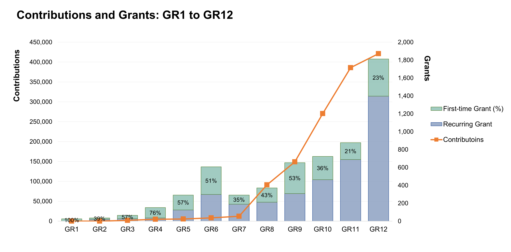
```

Overall, both contribution and grant witnessed a significant increase from GR1 to GR12. The most dramatic increases in contributions started from GR 7. In addition, the proportion of the first-time grant peaked in GR6 (51%), and it tended to fluctuate over the period shown. In the latest round (GR12), the number of grants rose to more than 1800, among which first-time grants accounted for about a quarter.

### 1.2 Amount Raised:

```{r}
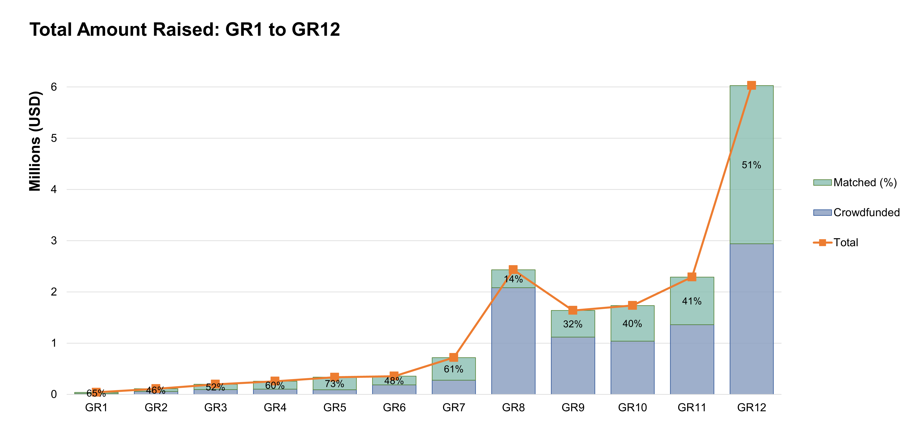
```

The fund raised also saw a clear increasing trend, despite a fluctuation among GR9 to GR11. In GR12, a total of $6.1M were raised, both the matched and crowdfunded amount achieved all-time highs, nearly tripled compared with the last round. Moreover, the proportion matched fund peaked in GR7(61%) and fluctuated throughout the whole period.

### 1.3 Grants by Category

```{r}
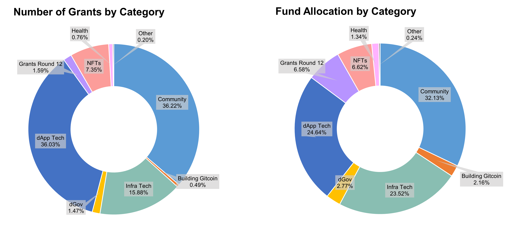
```

Grants of ‘community’ accounted for the greatest part both in numbers and amount raised. ‘DAPP tech’ and ‘infra tech’ placed second and third, respectively.

### 1.4 Grants by Region

```{r}
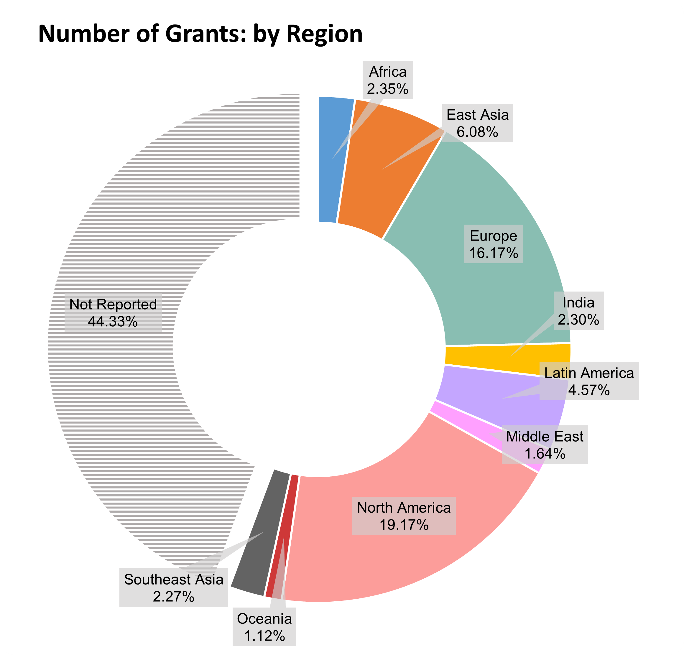
```

Information on location was not reported for about 44% grants. By looking at the available location data, North America, Europe and East Asia were the top three regions on the number of grants. In addition, the growth of grants extended to all continents of the world by GR6.

```{r}
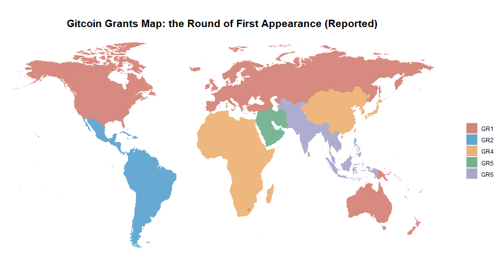
```

*GR1: North America, Europe, Oceania; GR2: Latin America; GR4: East Asia, Africa; GR5: Middle East; GR6: India, Southeast Aisa

## Part 2. A Longitudinal Analysis on Quadratic Funding

Gitcoin is currently the largest experiment of Quadratic Funding (QF): for each grant, the amount of funding to be awarded is a sum of the amount raised by crowdfunding and the matched amount according to the QF algorithm.
Now, let look at the distribution&percentile of crowdfunded amount, matched amount and the total amount one by one.

### 2.1 Crowdfunded Amount by Grants

```{r}
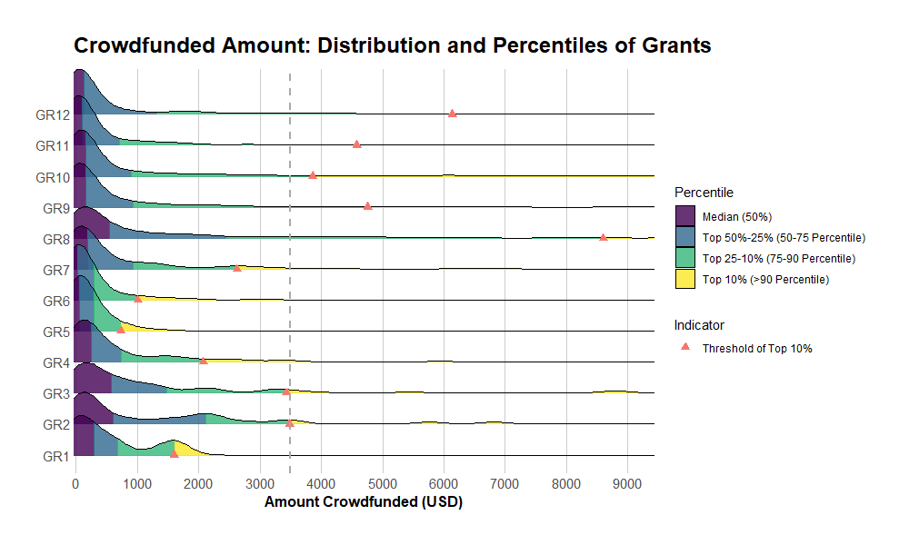
```

*As the curve for the top 10% grants may be difficult to read, an indicator was used to show its threshold.

In the most recent 4 rounds (GR9-GR12), the patterns of distribution were similar. The median amount that a grant raised from crowdfunding moved toward zero, and 50% grants received less than about $150 from crowdfunding. It means the proportion of grants with 0/small crowdfunding amount was increasing.

In contrast, the thresholds of being a top 10% in GR8-GR12 (all >$3500) were higher than those in GR1-7 (all <$3500), indicating the proportion of grants with an extra high crowdfunding amount (>5000) also saw a relative growth in the most recent rounds.

As a result of both trends, the tail of distribution was becoming longer and flatter.

### 2.2 Matched Amount by Grants

```{r}
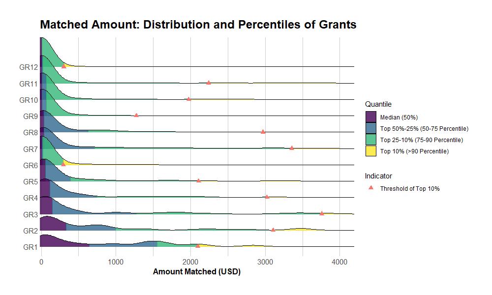
```

With respect to the distribution of matched amount, its median also showed a trend of moving toward zero. The first 3 quarters (75 percentile) of grants were limited within a narrow interval in the latest 4 rounds.
The threshold of the top 10% for GR12 was very low compared with other recent rounds. One potential reason is the introduction of ‘2.5% cap’ policy in GR12 - ‘To prevent any grant from dominating the matching pool, a 2.5% cap was imposed to restrict how much any one grant can take from the main round.’ With a certain of matched funds moving from the dominating grants to the rest, the threshold of the top 10% moved backwards to a great extent.

Before looking into the distribution of the total amount awarded, let’s make a comparison of the amount crowdfunded and matched. The ratio of matched amount / crowdfunded amount was calculated and presented:

```{r}
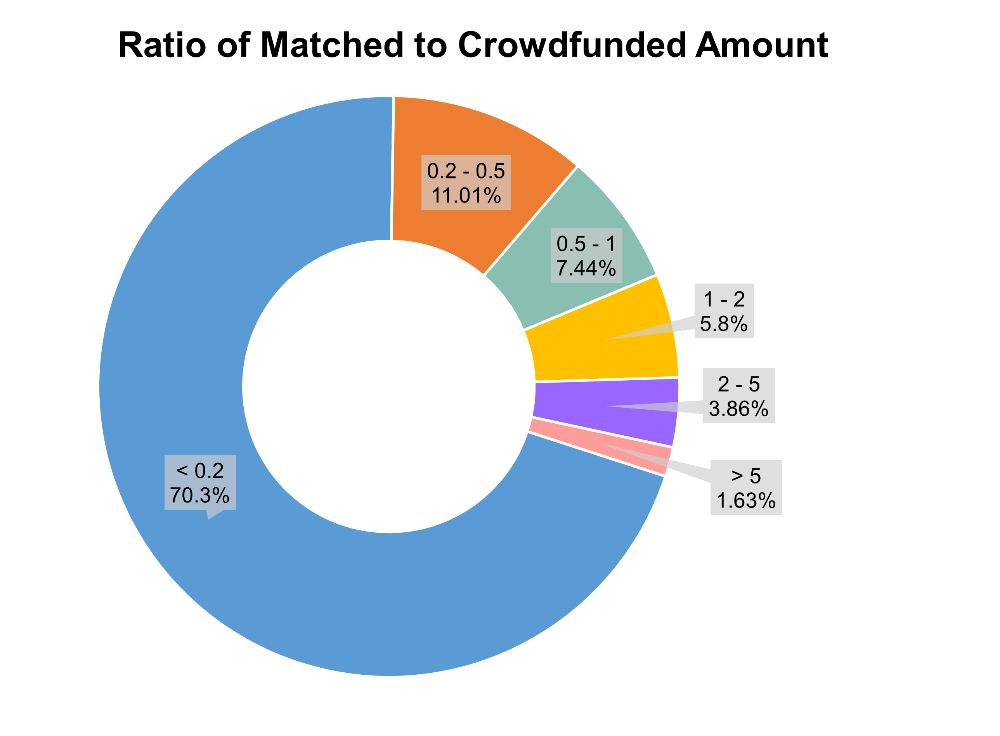
```

Through QF, about 10% grants received more money from matching pools than crowdfunding. (1-2 times: 5.8%; 2-5 times 3.86%; >5 times 1.63%)

### 2.3 Total amount by grants

```{r}
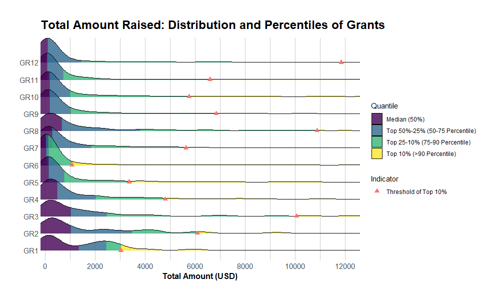
```

Although the total amount is the combination of both crowdfunded and matched amount, we find its distribution is closer to that of the crowdfunded funds. GR12 saw the highest threshold of top 10% grants, at about $12000.

### 2.4 Change of the Total Amount over Occur Times

A grant may occur in many grant rounds. As shown below, more than 70% grants were active in more than one round. There are 6 “all-timer” grants who had attended all the 12 rounds: 1. ethers.js - Complete, Simple and Tiny; 2. Lighthouse: Ethereum 2.0 Client; 3. Prysm by Prysmatic Labs; 4. Zero Knowledge Podcast; 5. EthHub - Ethereum Information Hub; 6. Ethereum Cat Herders Community Fund

```{r}
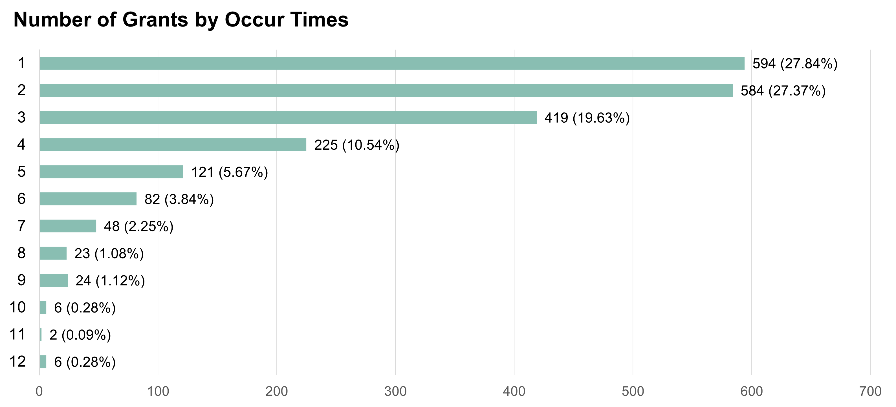
```

An interesting question here is to see if the funds raised changed as the increase of occur times. For this purpose, I made the below figure, including all the grants with more than 1 occur time. To show any changes, the ratio of sequent / first-time amount raised was calculated and presented. It was shown on a log scale and categorized by the amount raised at the first time.

```{r}
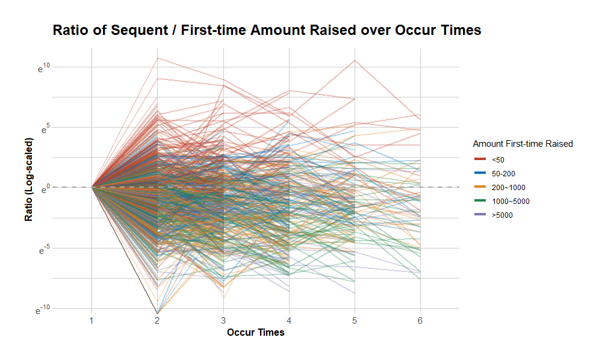
```

Each line represents a grant and transparency was applied for the overlapped. To further examine any trends over occur times, the ‘loess’ method was used to fit the data, and the estimated curve and corresponding 95% confidential intervals are shown below:

```{r}
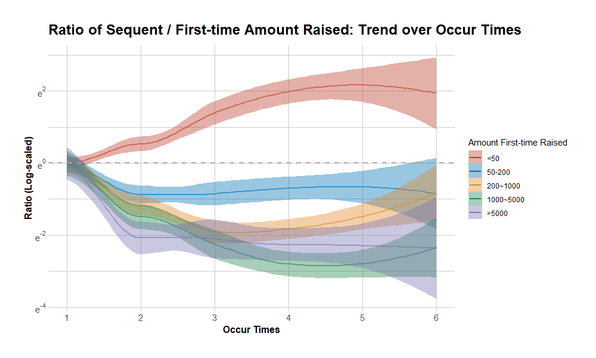
```

With the increase of occur times, fewer observations were available and the confidential interval became relatively wide.

The trends show the grants beginning with a small amount of fundraising were likely to be awarded more, as they recurring in more rounds. While it might be difficult for a grant to maintain a high-level income in multi rounds.

## Summary

- There have been significant growths in grants, contributions and funds over GR1 to GR12.
- As an ongoing experiment on the QF, there is still much to be explored and learned. For example, the current mechanism could be more dynamic( taking time factors into account), as we find the amounts a grant raised were not independent between round and round. Further research can be conducted to optimise the current mechanism when the data on individual contribution is available.

# freespirit

## Grants? What grants?

The recently concluded GR12 seemed like a great success judging by the numbers of contributors, crowdfunded amounts, number of grants and so on. However, those numbers are a topic of another analysis. This one instead focuses on the content of the grants - what were the topics that attracted most funds?

We would try to extract simple keywords (or phrases) from the grants' descriptions and then try to ruminate on what they mean.

But first - how to find the top grants? We'd like to consider `crowdfund_amount_contributions_usd` as the most important property of a grant - it speaks of the contributors' dedication.

```{python}
import os

import openai
import pandas as pd
```

```{python}
df = pd.read_csv('Grants Results History Round over Round + Grant over Grant - GR1-GR12.csv')
```

```{python}
# convert from string to float
df['crowdfund_amount_contributions_usd'] = df['crowdfund_amount_contributions_usd']\
    .astype(str)\
    .apply(lambda x: x.strip('$').replace(',', ''))\
    .astype(float)
```

```{python}
gr12_top3 = df[df['round_number'] == 12] \
    .sort_values(by='crowdfund_amount_contributions_usd', ascending=False) \
    .head(n=3)
gr12_top3[['grant_title', 'grant_id', 'url', 'crowdfund_amount_contributions_usd', 'num_unique_contributors']]
```

Next we can manually get the text description of each grant from its webpage. It has to be done manually as there is currently no API provided to properly get (e.g. by id) and we would like to avoid crawling the pages. The top 3 grants should be displayed with their id and urls so it would be easy to confirm that the following texts were copied from the grant web pages.

```{python}
text_4352 = """Vision

ZigZag wants to be a revolutionary project in the ZK Rollup space and aims at the end-game scaling solutions for Ethereum. We want to be the first, we want to be the best. We want to push out great products with high quality as fast as possible. We do not limit ourselves. Our vision is not to launch a mediocre DEX. Instead, we are aiming to bring the usability of centralised exchanges to a DEX that previously was not possible. With ZK Rollups, it is. Having sufficient liquidity and orderbook depth is a key factor that holds back a lot of DEXs from succeeding, which is what our main aim is to get right.

Introduction

ZigZag is a decentralised orderbook exchange that utilizes ZK-Rollup tech by allowing traders to perform spot trades with minimal slippage and thick orderbooks. The problem that every AMM-based DEX has on other Layer 2 Rollups is having miniscule liquidity. For simple swaps the impact on price movement is not significant. However, if one is attempting to trade with size relative to over $500k, to get the best quotes it is necessary to bridge back to mainnet Ethereum and pay its fees for aggregated liquidity that is available there. ZK Rollups can solve this by offering negligible fees on transactions, allowing for any market inefficiency to be taken advantage of in an instant by market makers, which was previously not possible on a DEX. We are aiming to acquire sufficient liquidity to the extent that users will not have to pay Ethereum gas fees on mainnet in order to get quoted for a similar price.

We launched as the first and still the only DEX on zkSync 1.x. We will also launch as the first DEX on StarkNet, which you can currently try out on our testnet (limited functionality). Due to our first mover advantage we are capturing a lot of attention. Our volume has been breaking records every week. Last week we had a total volume of $52M with a record breaking day of $13.2M in volume on the last day of the week.

Team background

Our team derives from crypto natives who are all experienced traders. Having personal experience in using decentralized exchanges allows us to recognize what is required for a DEX to succeed. The founder of ZigZag is a leading developer in Solidity, but we dare to say he is one of the, if not the best, Cairo dev out there. Our founder coded most of our DEX on zkSync and is the reason we exist and captured the first mover advantage we have. Another experienced dev joined our team recently and focuses on StarkNet and coding a non-custodial liquidity pool for market makers. With these guys we have a confirmed advantage and head start over any other competition building on StarkNet. Our team is joined by a small group of experienced devs who are very committed to helping us expand ZigZag even more. We are also in contact with most of the big and small players that are building next to us and are looking forward to collaborating with anyone for the good of Ethereum’s scalability.

With our combined skills, trading knowledge and maybe most importantly full-time commitment, we have the ability to create a leading DEX on zkSync and StarkNet from the development side, as well as ensuring that the incentives for traders are sufficient for them to not require an alternative.

Achievements and future plans

Currently, we have our exchange live on zkSync 1.0. We’re using the native zkSync atomic swap feature to match orders. The gas fee is paid to the relayer and included in the atomic swap. We also made a bridge UI that taps into zkSync’s smart contract to bridge between Ethereum and zkSync. We have a StarkNet testnet up, but right now with limited functionality. However, this will soon change as Starkware is moving quickly. Be sure to check out our announcements. Furthermore, our governance proposal for Frax passed (https://gov.frax.finance/t/fip-36-frax-x-zigzag-partnership/272): Frax will provide us for a total of $20M in liquidity. The first millions have arrived. This liquidity will be used to keep our DEX liquid on zkSync for now and once StarkNet fully launches we will move the majority of our liquidity there since it will have more functionality. We also have a MIM proposal up (https://forum.abracadabra.money/t/proposal-bring-mim-onto-starknet-through-zigzag-exchange/1065) to kickstart our DEX on StarkNet, since StarkNet will have more functionality than zkSync 1.0 currently has.

Limit orders and margin trading will be possible on StarkNet and zkSync 2.0. On StarkNet we are also building a non-custodial liquidity pool that market makers can tap into to use and market make on our DEX. We can turn this into a dAMM. As said before, we made a bridge UI for zkSync, but we are working on a fast withdrawal mechanism. We’re also working on a bridge UI for StarkNet and will provide fast withdrawals there too. Another future plan is adding more bridges to our website. One that has the most priority would be zkSync <-> StarkNet. We are thinking further into the future about implementing NFT related features on zkSync: viewing and sending NFTs on our website. We would later turn this into the first NFT Marketplace.

We’re eagerly awaiting zkSync 2.0, which will be zkEVM. This will give us way more possibilities on our DEX. We might even build on other Layer 2 ZK Rollups if we have the developer capacity for it. Once Loopring, ZKSwap and Polygon Hermez are zkEVM, we could start building there.

Reasoning for grant

As the first DEX on zkSync we've been very active in the zkSync ecosystem, but also with the community and catering to them. One of the few live use cases on zkSync right now, besides our DEX, is donating to Gitcoin grants. This can be done in a cheap way by either by bridging funds from Ethereum Layer 1 -> zkSync Layer 2 (https://trade.zigzag.exchange/bridge) or by using a fiat ramp like Ramp Network (https://ramp.network/) to zkSync. These Gitcoin grants created demand for DAI, so a while back we added DAI pairs to our exchange (ETH/DAI, WBTC/DAI, DAI/USDC, DAI/USDT). A lot of people started using ZigZag to grab DAI for Gitcoin grants and started requesting us to create our own grant. They wanted to donate to us! We decided to open a Twitter poll (https://twitter.com/ZigZagExchange/status/1469983150180909057) and after 1 day more than 1300 people voted "Yes", telling us that they would want to donate to us. This gave us great confidence in creating our own grant.

Use of funds

As seen in our tweet, we are self funding right now. This Gitcoin grant will give us the ability to spend more funding on development. We would love to scale up our development team and with the support of our community it seems like we will be able to do this. Development can mean anything ranging from frontend and backend development to GFX/UI/UX design.

Developer? Contact us!

We would love to hear your feedback on our product, so please use our exchange, read our code in Github and join our community. If you are interested in our project and think that you could help us out or even contribute to building on ZK Rollups, don't hesitate and contact us here: https://info.zigzag.exchange/#contact. With our grant donations we will be able to take onboard more developers and maybe that person will be you! Who knows we’ll even see you on our team in the future!"""
```

```{python}
text_2323 = """Dark Forest is an MMO strategy game built with zkSNARKs on Ethereum and xDAI. Players explore an infinite, procedurally-generated universe, conquering planets and growing a space empire. More info: zkSNARKs for blockchain gaming

Over 2,500+ crypto enthusiasts have participated in the first four whitelisted Dark Forest rounds, spending over one trillion gas on xDAI chain and the Ropsten testnet. This playerbase represents about 15% of our current waitlist, and we're excited to continue development so that we can open up the game to more players.

>>> What have we been up to?

After the previous Gitcoin grant round concluded, we launched DF v0.6 Round 4, aka The Lightning Round. We’ve also seen an abundance of life come from within the community in the form of the Dark Forest Community Art Contest, MarrowDAO’s recent Dark Forest Community Round, and d_fdao's recently announced Dark Forest Community New Year's Round!

We are actively seeking a front end web developer. (Sign up for the Dark Forest Jobs newsletter if you’d like to be notified of new openings!)

We’ve got one more round of v0.6 left, which will likely launch in Q1 2022. After that, we plan to embark on the next stage of our development cycle: v0.7. In addition to releasing rounds ourselves, we are enabling individual players and DAOs to deploy their own rounds, adding a unique spin to our core game.

Throughout 2022, we hope to facilitate the launch of many community rounds, so that players can play the game without having to wait for our months-long release process. Your contributions, in addition to fostering the growth of Dark Forest, will help make that happen.

We’ve learned a ton from shipping this game for our enthusiastic audience, and are eternally grateful for the opportunity to build such an outlandish piece of software.

Join the Dark Forest Discord if you'd like to get involved.

Image

Image

Decentralized Digital Worlds: We want to build a massively-multiplayer persistent and economic universe, interoperable with the rest of the Ethereum metaverse. We believe that zkSNARKs will unlock the first generation of truly compelling decentralized games, and that decentralized games will pave the way for the community-owned and community-designed digital worlds of the future.

Community-driven: Beyond working on the Dark Forest game itself, our team also works closely with Project Sophon, a group of players working on third-party tools. Our vision is for the Dark Forest gameplay experience to be built and freely modified by the community. For a taste of this, see the Dark Forest Community Plugins Homepage.

ETH/ZK Education: We're also spending time on community and education initiatives aimed at bringing both Ethereum and zero-knowledge application development to more students and developers, including educational programs, starter repos and shared infrastructure, and more (to be announced on our blog in the coming weeks!)

Our work so far has been supported by a handful of one-off developer grants from organizations like xDAI, the Mozilla Builders program, and an in-game tip jar. Additionally, we are now funded by a new research foundation: 0xPARC. You can read more about it here.

We're so thankful to be a part of this ecosystem and we're excited to keep building for you all! :)"""
```

```{python}
text_1668 = """Based in Washington, D.C., Coin Center is the leading non-profit research and advocacy center focused on the public policy issues facing cryptocurrency and decentralized computing technologies like Bitcoin and Ethereum.

Our mission is to build a better understanding of these technologies and to promote a regulatory climate that preserves the freedom to innovate using permissionless blockchain technologies.

We do this by producing and publishing policy research from respected academics and experts, educating policymakers and the media about blockchain technology, and by engaging in advocacy for sound public policy."""
```

Now that we have the texts we can get the top keywords or key phrases. For that, we chose a simple call to OpenAI's GPT3 service which is a top NLP model and should be good at keyword detection. But first - merge the data.

```{python}
gr12_top3['body'] = [text_4352, text_2323, text_1668]
# Prepare the texts for GPT3 - we need to clean them from new lines
gr12_top3['body'] = gr12_top3['body'].apply(lambda text: text.replace('\n', ' '))
print(gr12_top3['body'])
```

The next section is non-deterministic as GPT3 is itself non-deterministic - it often returns different results, sometimes empty ones. It may need to be rerun once or twice. To ensure proper work one need to fiddle with the OpenAI completion parameters. For our current purposes it's good enough as a few different runs usually return similar results - we can be confident in GPT3's predictions.

```{python}
openai.api_key = "<redacted>"

def get_keywords(text: str):
    prompt = f"Text: {text}\n\nKeywords:"
    # print(prompt)
    return openai.Completion.create(
        engine="davinci",
        prompt=prompt,
        temperature=0.3,
        max_tokens=120,
        top_p=1.0,
        frequency_penalty=0.8,
        presence_penalty=0.0,
        stop=["\n"]
    )

grant_keywords = []
for text in gr12_top3['body']:
    response = get_keywords(text)
    # print(response)
    keywords = response['choices'][0]['text'].split(',')
    keywords = [k.strip() for k in keywords]
    grant_keywords.append(keywords)
    # print(keywords)

gr12_top3['keywords'] = grant_keywords
```

## Words

Now, let's explore the keywords of the top 3 grants.

```{python}

for row in gr12_top3.itertuples():
    result = f'{row.grant_title} - {", ".join(row.keywords)} - ${row.crowdfund_amount_contributions_usd}.'
    print(result)
```

----

## Bonus - trends

Let's check the previous round's most supported grants and see how they differ from GR12.

```{python}
gr11_top3 = df[df['round_number'] == 11]\
    .sort_values(by='crowdfund_amount_contributions_usd', ascending=False)\
    .head(n=3)
gr11_top3[['grant_title', 'grant_id', 'url', 'crowdfund_amount_contributions_usd', 'num_unique_contributors']]
```

```{python}
text_2323 = """Dark Forest is an MMO strategy game built with zkSNARKs on Ethereum and xDAI. Players explore an infinite, procedurally-generated universe, conquering planets and growing a space empire. More info: zkSNARKs for blockchain gaming

Over 2,500+ crypto enthusiasts have participated in the first four whitelisted Dark Forest rounds, spending over one trillion gas on xDAI chain and the Ropsten testnet. This playerbase represents about 15% of our current waitlist, and we're excited to continue development so that we can open up the game to more players.

>>> What have we been up to?

After the previous Gitcoin grant round concluded, we launched DF v0.6 Round 4, aka The Lightning Round. We’ve also seen an abundance of life come from within the community in the form of the Dark Forest Community Art Contest, MarrowDAO’s recent Dark Forest Community Round, and d_fdao's recently announced Dark Forest Community New Year's Round!

We are actively seeking a front end web developer. (Sign up for the Dark Forest Jobs newsletter if you’d like to be notified of new openings!)

We’ve got one more round of v0.6 left, which will likely launch in Q1 2022. After that, we plan to embark on the next stage of our development cycle: v0.7. In addition to releasing rounds ourselves, we are enabling individual players and DAOs to deploy their own rounds, adding a unique spin to our core game.

Throughout 2022, we hope to facilitate the launch of many community rounds, so that players can play the game without having to wait for our months-long release process. Your contributions, in addition to fostering the growth of Dark Forest, will help make that happen.

We’ve learned a ton from shipping this game for our enthusiastic audience, and are eternally grateful for the opportunity to build such an outlandish piece of software.

Join the Dark Forest Discord if you'd like to get involved."""

text_468 = """ETHPlanet is a ethereum community with a spirit of open source, sharing, and mutual growth. We are committed to serving the ethereum ecosystem and its developers, communities, projects, and related platforms. We organize online and offline activities, including global conferences, forums, hackathons, etc., and are constantly exploring new ways to support and grow together with Ethereum."""

text_373 = """About Nym
The Nym network is a decentralized mixnet to support anonymity and unlinkability at the network layer (layer 0) across any blockchain and application. Unlike Tor and Katzenpost/Meson, Nym uses blockchains in order not to have a central directory and uses incentives to decentralize the mix network itself. Due to cover traffic and timing delays based on the Loopix design, Nym provides superior privacy than both VPNs and Tor, and can be integrated to communicate with any blockchain to enable communication without censorship or fear. Nym fills in the missing pieces of the cryptographic revolution necessary to end mass surveillance.
Learn more from our litepaper.

Team Nym
The Nym team is comprised by established coders and researchers in privacy-enhancing technologies.
Harry Halpin, CEO is a renowned computer scientist and a leader in the movement against mass surveillance who worked under web inventor Tim Berners-Lee at the World Wide Web Consortium, lead NEXTLEAP and PANORAMIX, amongst other accomplishments.
Claudia Diaz, CSO (Chief Science Officer) with 20 years working on privacy-enhancing technologies, she is one of Europe’s preeminent researchers in the field recognized for her contribution to the foundations of metadata protection from surveillance, traffic analysis, tracking, localization and behavioral profiling.
Dave Hrycyszyn, CTO has founded, built and sold several companies from Chainspace, Blockmainia, and the Vega protocol. He is a co-author of the blockchain-sharding protocol Chainspace and the leaderless, PBFT-variant consensus protocol Blockmania, the prototype of which turned out to be likely the world’s fastest distributed ledger (400,000 TPS with 2 secs finality).
Jedrzej Stuczynski, Lead Developer has a Master of Engineering in Computer Science with First Class Honours from University College London. During his thesis work he studied the Coconut signature scheme under the supervision of George Danezis and then implemented it.
Ania Piotrowska, Head of Research has masters degree with specialization in Analysis of Algorithms from the Faculty of Fundamental Problems of Technology at Wroclaw University of Technology and is a designer of the Loopix mixnet, with her PhD advisor and original Nym and Chainspace co-founder George Danezis.

More on our team here.

Status
We just launched our Rust code for the Nym mixnet at the end of December 2019. For the rest of Q1 2020, we are fine tuning our validator development in order to prepare for beta release that will enable use of Nym with Bitcoin and Ethereum.
https://github.com/nymtech/nym

Resources
Github
Documentation

Contact
For questions and comments, you can reach us on our official channels.
Twitter
Telegram
"""
```

```{python}
assert all(grant_id == text_id
           for grant_id, text_id in zip(gr11_top3['grant_id'].to_numpy(),
                                        [2323, 468, 373]))
gr11_top3['body'] = [text_2323, text_468, text_373]
# Prepare the texts for GPT3 - we need to clean them from new lines
gr11_top3['body'] = gr11_top3['body'].apply(lambda text: text.replace('\n', ' '))
print(gr11_top3['body'])
```

```{python}
grant_keywords = []

for text in gr11_top3['body']:
    response = get_keywords(text)
    keywords = response['choices'][0]['text'].split(',')
    keywords = [k.strip() for k in keywords]
    grant_keywords.append(keywords)

gr11_top3['keywords'] = grant_keywords
for row in gr11_top3.itertuples():
    result = f'{row.grant_title} - {", ".join(row.keywords)} - ${row.crowdfund_amount_contributions_usd}.'
    print(result)
```

----

## Conclusion

Can we say something about the topics of the most crowdfunded grants? We can conclude that:

 * blockchain games (GameFi, etc.) remain a top interest. Particularly - Dark Forest is among top 3 in two consecutive rounds
 * rollups, L2, etc. became more popular
 * privacy and anonymity gave way to policy and research
 * the top 3 GR12 grants have attracted 2.5x more crowdfunded amounts - from ~160k to ~425k
 * the number of unique contributors (total for top 3) has almost doubled - from ~14k to ~27k

Once the grant texts' are available through an API this approach may be extended to all historical rounds to see how the trends are shifting. One interesting question is what would be the most popular topics of GR13...

# kalverra

## Gitcoin Grants Analysis

As requested in a [gitcoin grant itself](https://gitcoin.co/issue/gitcoinco/skunkworks/252/100027341), I want to take a look at the data of Gitcoin grants since the program's creation in November 2017. I hope to elicit some novel information from the data on how quadratic funding has looked so far, and how we might compare it to other systems of funding these sorts of projects.

## Background

[Gitcoin](https://gitcoin.co/) is a program to crowd-fund open source projects by using cryptocurrencies and [quadratic funding](https://vitalik.ca/general/2019/12/07/quadratic.html). The idea is a twist on [quadratic voting](https://en.wikipedia.org/wiki/Quadratic_voting) which enables democratic participants to not only indicate their preference, but also their **level** of preference. 

## Data Exploration and Cleaning

Let's take a look at the basic data sets we've got from the grant that spurred this analysis, utilizing the handy [pandas_profiling](https://pandas-profiling.github.io/pandas-profiling/docs/master/index.html) tool. 

```{python}
import pandas as pd
import pandas_profiling
import numpy as np
import matplotlib.pyplot as plt
import seaborn as sns
pd.set_option("plotting.backend", "matplotlib")
sns.set_theme(style="darkgrid")
plt.figure(figsize=(20, 5))

# Convert currency amounts to a Decimal to safely deal with currency arithmetic
def currency_to_decimal(value):
  value = str(value)
  value = value.replace(",", "")
  value = value.replace("$", "")
  if value == "":
    value = "0.00"
  return float(value)

grants_data = pd.read_csv('Grants Results History Round over Round + Grant over Grant - GR1-GR12.csv', converters={"match_amount": currency_to_decimal, "crowdfund_amount_contributions_usd": currency_to_decimal, "total": currency_to_decimal})

# Finding a lot of missing values in the `crowdfund_amount_contributions_usd` and `total` which seem to be cases where
# either there was no funding period, or the only funder was the Gitcoin bot. https://gitcoin.co/gitcoinbot
# Add column to indicate where gitcoin bot is only funder
grants_data["only_gitcoin_bot_funded"] = np.where((grants_data["match_amount"] > 0) & (grants_data["num_unique_contributors"] == 0), True, False)

# Clean up some inconsistencies with `region`
grants_data.loc[(grants_data["region"] == "undefined") | (grants_data["region"].isna()), "region"] = "none"

# Let Pandas know what data types we're dealing with
grants_data["round_start_date"] = pd.to_datetime(grants_data['round_start_date'],format='%Y-%m-%d')
grants_data["round_end_date"] = pd.to_datetime(grants_data['round_end_date'],format='%Y-%m-%d')
grants_data = grants_data.astype({
  "round_number": "category",
  "grant_title": str,
  "region": "category",
  "category": "category",
  "url": str})

# Get a nice overview of our data
pandas_profiling.ProfileReport(grants_data)
```

## Data Analysis

Let's take a look at couple things that you'd probably expect to be true generally about the data. Some of these hypotheses and their corresponding conclusions will probably elicit a "well, duh", but it never hurts to be sure. It can also reveal some areas that we can look further into.

### Funding Over Time

Let's see a few macro trends as the Gitcoin program has grown.

```{python}
total_fund_amount_by_round = grants_data.groupby(["round_number"]).agg({"total": "sum"})
total_matched_by_round = grants_data.groupby(["round_number"]).agg({"match_amount": "sum"})
total_crowdfunded_by_round = grants_data.groupby(["round_number"]).agg({"crowdfund_amount_contributions_usd": "sum"})

summarized_totals = total_crowdfunded_by_round.merge(total_matched_by_round, on="round_number").reset_index()
summarized_totals = summarized_totals.merge(total_fund_amount_by_round, on="round_number")
```

Total funding amounts were on a fairly slow, linear growth until round 8 had an explosion of crowdfunding. This retracted a bit, then turned into a bit of an exponential curve. I'd suspect that matching amount likely has a strong correlation with how much individual contributors are willing to kick in, but that doesn't seem to be the case, at least not until round 12. We're going to dig into this later, but for now I wonder if the rising ETH-USD price made people more generous? Let's map the total funding amounts against the USD price of ETH (courtesy of [CoinDesk](https://www.coindesk.com/price/ethereum/)).

```{python}
# Let's cut down the ETH price noise, and only grab the 24 hour high from the grant's opening date
eth_price = pd.read_csv("./kalverra/data/eth-usd-coindesk.csv")
eth_price["Date"] = pd.to_datetime(eth_price["Date"],format='%Y-%m-%d')
opening_grants_dates = grants_data["round_start_date"].unique()
price_highs = eth_price.loc[eth_price["Date"].isin(opening_grants_dates)]["24h High (USD)"].reset_index().drop(columns=["index"])

# Cool, now merge it with our total funding amounts for Gitcoin rounds
price_highs.index = np.arange(1, len(price_highs)+1)
price_highs = price_highs.join(total_fund_amount_by_round)
price_highs = price_highs.rename(columns={"24h High (USD)": "ETH-USD Price", "total": "USD Raised"})

# Now build a plot
highest_price = price_highs.plot(y="ETH-USD Price")
total_funded = highest_price.twinx()
price_highs.plot(y="USD Raised", ax=total_funded, color="r", title="ETH-USD Price vs Total USD Raised per Gitcoin Round", figsize=(19,10))

# Calculate our percent changes from the last time
price_highs["ETH-USD %Change"] = price_highs["ETH-USD Price"].pct_change()
price_highs["USD Raised %Change"] = price_highs["USD Raised"].pct_change()
price_highs
```

It seems that, while the ETH-USD price is maybe not **causing** the Gitcoin funding to increase at a similar rate, it certainly is **correlated**. This doesn't quite explain that dip in total funding after week 8. Perhaps that initial pop of sending ETH to \$500+ drove excitement that later tapered off into "the new normal"? I imagine a lot of people got excited for some reason. I'm not sure WHY, but we can use Google trends to get some idea of how popular Gitcoin was at different periods of time.

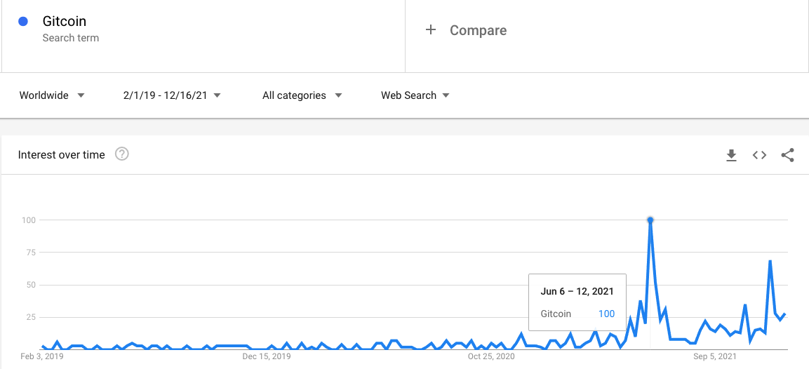

Well that doesn't really match up. [Google trends](https://trends.google.com/trends/explore/TIMESERIES/1640127600?hl=en-US&tz=300&date=2019-02-01+2021-12-16&q=Gitcoin&sni=3) shows the `Gitcoin` term getting big in early June, 2021. That would be around the beginning of Round 10, which raised a total of \$1,733,505.44. Google trends is probably an imperfect tool for something like this, but that huge spike is perplexing. Perhaps there was a major press push around then? I tried comparing the terms `Ethereum` and `Gitcoin` side-by-side, and `Gitcoin` barely registered. Either way, we'll have to dig more into the latest round, round 12, which shows a gigantic spike in all metrics. My bet is on the massive amount of matching money that was being offered.

### Feast or Famine?

A lot of projects are getting very little to no funding, with almost 20% total showing \$0 raised, and plenty more showing very small sums of money. Let's look at how much of a disparity there is among these projects, and how things have changed over time. For this analysis, we'll consider any total raised under \$10 to mean `little to no funding`. The world being as it is, \$10 USD will go a lot further for you in India than it will in the U.S.A., but you'd have a hard time sustaining an individual (or a team for that matter) for much longer than a couple days anywhere for that amount. So we'll treat \$10 as a cutoff. Other ranges are chosen a bit more arbitrarily.

```{python}
# I'm sure there's a cleaner, pandas native way of getting this done, but I'm wasting too much time looking for it.
# It's annoying because this feels like something that could be done in 1 or 2 clean lines. Advice is appreciated
results_dict = {
  "Round Number": [1, 2, 3, 4, 5, 6, 7, 8, 9, 10, 11, 12],
  "Total Amount of Grants": [],
  "Total Grants <= $10 Raised": [],
  "Total Grants $10 > Raised <= $1,000": [],
  "Total Grants $1,000 > Raised <= $10,000": [],
  "Total Grants $10,000 > Raised": [],
  "Percent of Grants <= $10 Raised": [],
  "Percent of Grants $10 > Raised <= $1,000": [],
  "Percent of Grants $1,000 > Raised <= $10,000": [],
  "Percent of Grants $10,000 > Raised": [],
}

# Loop through all our rounds and find out our total funded amounts
for i in range(1, 13):
  total_grants = (grants_data["round_number"] == i).sum()
  
  small_funded = grants_data.loc[(grants_data["total"] <= 10)&(grants_data["round_number"] == i), "total"].count()
  kinda_funded = grants_data.loc[(grants_data["total"] > 10)&(grants_data["total"] <= 1000)&(grants_data["round_number"] == i), "total"].count()
  mostly_funded = grants_data.loc[(grants_data["total"] > 1000)&(grants_data["total"] <= 10000)&(grants_data["round_number"] == i), "total"].count()
  large_funded = grants_data.loc[(grants_data["total"] > 10000)&(grants_data["round_number"] == i), "total"].count()

  results_dict["Total Amount of Grants"].append(total_grants)
  results_dict["Total Grants <= $10 Raised"].append(small_funded)
  results_dict["Total Grants $10 > Raised <= $1,000"].append(kinda_funded)
  results_dict["Total Grants $1,000 > Raised <= $10,000"].append(mostly_funded)
  results_dict["Total Grants $10,000 > Raised"].append(large_funded)

  results_dict["Percent of Grants <= $10 Raised"].append(round(small_funded / total_grants, 2))
  results_dict["Percent of Grants $10 > Raised <= $1,000"].append(round(kinda_funded / total_grants, 2))
  results_dict["Percent of Grants $1,000 > Raised <= $10,000"].append(round(mostly_funded / total_grants, 2))
  results_dict["Percent of Grants $10,000 > Raised"].append(round(large_funded / total_grants, 2))

funding_amounts_summary = pd.DataFrame(data=results_dict).set_index("Round Number")
funding_amounts_summary
funding_amounts_percentages = funding_amounts_summary[funding_amounts_summary.columns.drop([
  "Total Amount of Grants", 
  "Total Grants <= $10 Raised", 
  "Total Grants $10 > Raised <= $1,000",
  "Total Grants $1,000 > Raised <= $10,000",
  "Total Grants $10,000 > Raised"])]
funding_amounts_totals = funding_amounts_summary[funding_amounts_summary.columns.drop([
  "Percent of Grants <= $10 Raised", 
  "Percent of Grants $10 > Raised <= $1,000", 
  "Percent of Grants $1,000 > Raised <= $10,000",
  "Percent of Grants $10,000 > Raised"])]
funding_amounts_percentages.plot(stacked=True, kind="bar", figsize=(20,10), ylabel="Percent of Grants", title="Percentages of Grant Funding Amounts")
funding_amounts_totals.plot(figsize=(20,10), ylabel="Total Grants", title="Total Grants Funding Counts")
```

Well that's interesting. It seems that the first Gitcoin rounds were fairly high in funding, with large portions of projects receiving more than \$1,000 in funding. As the `Total Amount of Grants` experiences sharp increases, the funding distribution shifts dramatically with lots of projects receiving little funding. This seems like a simple conclusion that if there are more projects to choose from, a lot of them get lost in the mix and receive little funding (see rounds 6 and 12). As a user personally, I would be much more encouraged to donate money to a project that already has a decent amount of money allocated to it, meaning that my funds have a smaller chance of going to "waste". If I see a project has only raised \$5 after a few days of funding, it's easy to imagine the project's creators being discouraged and abandoning the project, and donating an extra \$10 to bring their total to \$15 (ignoring matching) is unlikely to change that narrative.

I wanted to compare this trend to other charity grant systems, but couldn't find any that really emulate the approach that Gitcoin has. The best I could find is a [FiveThirtyEight analysis](https://fivethirtyeight.com/features/why-long-shot-candidates-are-raising-more-money-than-ever/) on long-shot Republican candidates fund raising for 2020 campaigns in the U.S. I think political candidate fundraising has *some* equivalencies to the Gitcoin system.

* It's open, so potential donators can see how much money has been raised, and also have rough odds as to how likely the candidate is to win
* Helping your preferred candidate win an election has some corollaries to funding an open-source project you consider interesting (pride, belief that it will help yourself and others)
* No one wants to waste money on a candidate that will lose anyway

The results of Republican candidate fund raising look pretty similar to the Gitcoin rounds: as more enter the race, fewer receive significant funding. It's obviously a flawed comparison (charity isn't winner-take-all like politics, politics tends to be more anger-driven, etc) but I think it shows that similar systems get similar results. 

In order to confirm this suspicion and dig deeper, I'd need more granular data on how grants are funded over time. I'd also like to see if there are any other similar charity models to compare against.

What about the projects that earned the most? And how does the amount of rounds you participate in correlate with the total funding you've received?

```{python}
top_funded_grants = grants_data.groupby(["grant_id"]).agg({"total": "sum", "round_number": "count", "grant_title": "first"}).sort_values(["total"], ascending=False).rename(columns={"round_number": "Number of Rounds Present", "total": "Total USD Raised"})
top_funded_grants.head(30)
top_funded_grants.corr(method ='pearson')
```

At first, I would say that the weak correlation between `Number of Rounds Present` and `Total USD Raised` would be surprising. But with how many new grants were started in Round 12, and the huge amount of funding Round 12 had shows that recent grants had a much better chance of getting big money.

## Overall Lessons Learned

* Gitcoin contributions are rising quickly
* The Price of ETH-USD combined with increased awareness is likely driving higher funding amounts

## Round 12 Specific Lessons

* The more grants there are, the more that get ignored. This seems partly due to the inevitability of attention-based systems (much easier to find something in a pile of 25 than a pile of 2,000) to favor the top. Also it's likely that participants are avoiding potential waste.
* With a big explosion of funds in Round 12, a large amount of new projects were able to get large amounts of funding

## Avenues Worthy of Further Exploration

* Find a good control to compare Gitcoin's quadratic funding approach against
* In a few years, check back on these projects that raised large amounts and see their progress vs. those that raised very little
* Obtain a deeper understanding and better cutoffs for funding amounts, rather than rather arbitrarily chosen values (\$10, \$1000, etc...)

# rezahsnz

```{python}
import numpy as np
import pandas as pd
import matplotlib.pyplot as plt
import matplotlib.patches as mpatches
import matplotlib.ticker as tick
import seaborn as sns
```

```{python}
df_grants = pd.read_csv('Grants Results History Round over Round + Grant over Grant - GR1-GR12.csv')

df_grants[["crowdfund_amount_contributions_usd", "match_amount", "total"]] = df_grants[["crowdfund_amount_contributions_usd", "match_amount", "total"]].replace('[\$,]', '', regex=True).astype(float)

# fill nulls with appropriate values, 0 for $ and unknown for regions
df_grants = df_grants[df_grants.columns[~df_grants.columns.str.startswith('Unnamed')]]
df_grants['crowdfund_amount_contributions_usd'] = df_grants['crowdfund_amount_contributions_usd'].fillna(0.0) 
df_grants['total'] = df_grants['total'].fillna(0.0) 
df_grants['region'] = df_grants['region'].fillna('undefined')
df_grants['region'] = df_grants['region'].replace('none', 'undefined')
df_grants['crowdfund_amount_contributions_usd'] = df_grants['crowdfund_amount_contributions_usd'].fillna(0)
df_grants['match_amount'] = df_grants['match_amount'].fillna(0)
df_grants['total'] = df_grants['total'].fillna(0)
```

```{python}
# source: https://dfrieds.com/data-visualizations/how-format-large-tick-values.html
def reformat_large_tick_values(tick_val, pos):
    """
    Turns large tick values (in the billions, millions and thousands) such as 4500 into 4.5K and also appropriately turns 4000 into 4K (no zero after the decimal).
    """
    if tick_val >= 1000000000:
        val = round(tick_val/1000000000, 1)
        new_tick_format = '{:}B'.format(val)
    elif tick_val >= 1000000:
        val = round(tick_val/1000000, 1)
        new_tick_format = '{:}M'.format(val)
    elif tick_val >= 1000:
        val = round(tick_val/1000, 1)
        new_tick_format = '{:}K'.format(val)
    elif tick_val < 1000:
        new_tick_format = round(tick_val, 1)
    else:
        new_tick_format = tick_val

    # make new_tick_format into a string value
    new_tick_format = str(new_tick_format)
    
    # code below will keep 4.5M as is but change values such as 4.0M to 4M since that zero after the decimal isn't needed
    index_of_decimal = new_tick_format.find(".")
    
    if index_of_decimal != -1:
        value_after_decimal = new_tick_format[index_of_decimal+1]
        if value_after_decimal == "0":
            # remove the 0 after the decimal point since it's not needed
            new_tick_format = new_tick_format[0:index_of_decimal] + new_tick_format[index_of_decimal+2:]
            
    return new_tick_format
```

```{python}
print("total funds raised: ${}".format(df_grants['total'].sum()))
print("total crowdfunds: ${}".format(df_grants['crowdfund_amount_contributions_usd'].sum()))
print("total matched amounts: ${}".format(df_grants['match_amount'].sum()))
print('total grants: {}'.format(df_grants['grant_id'].nunique()))
print('total contributions: {}'.format(df_grants['num_contributions'].sum()))
print('average amount of contributions per grant: ${}'.format(df_grants['total'].sum() / df_grants['num_contributions'].sum()))
```

```{python}
total = df_grants.groupby('round_number')['total'].sum().reset_index()
total_crowdfund_amount = df_grants.groupby('round_number')['crowdfund_amount_contributions_usd'].sum().reset_index()
total_crowdfund_amount.columns = ['round_number', 'total']

sns.set(font_scale=1.4)
plt.figure(figsize=(14, 14))
sns.set_style("darkgrid", {"grid.color": ".1", "grid.linestyle": ":"})

bar1 = sns.barplot(x="round_number",  y="total", data=total, color='brown')
bar2 = sns.barplot(x="round_number", y="total", data=total_crowdfund_amount, estimator=sum, ci=None,  color='orange')
top_bar = mpatches.Patch(color='brown', label='Total Match amount')
bottom_bar = mpatches.Patch(color='orange', label='Total Crowdfund amount')
plt.legend(handles=[top_bar, bottom_bar])
plt.xlabel("Round number")
plt.ylabel("Total amounts raised in $")
plt.ylim(0, 7000000)
plt.yticks([35000, 200000, 350000, 700000, 1000000, 1500000, 2000000, 3000000, 4000000, 5000000, 6000000], fontsize=14)
plt.ticklabel_format(style='plain', axis='y')
plt.title("Amount of funds raised per round", fontsize=18)
ax = plt.gca()
ax.yaxis.set_major_formatter(tick.FuncFormatter(reformat_large_tick_values))
plt.show()
```

```{python}
df_grants_per_round = df_grants.groupby('round_number')['grant_id'].size().reset_index(name='count')
df_grants_per_round.head(n=13)
df_new_grants = np.zeros((12, 1), dtype='int')
for r in range(1, 13):
    grants_this_round = df_grants.loc[df_grants['round_number'] == r, ['grant_id']]
    df_new_grants[r - 1] = grants_this_round['grant_id'].nunique()
    if r == 1:
        continue
    old_grant_pool = df_grants.loc[df_grants['round_number'] < r, ['grant_id']]
    old = 0
    for grant_id in grants_this_round['grant_id']:
        mask = grant_id == old_grant_pool['grant_id']
        if mask.values.sum() > 0:
            df_new_grants[r - 1] -= 1
df_grants_per_round['new_grants'] = df_new_grants
df_grants_per_round['pct_new'] = 100 * (df_grants_per_round['new_grants'] / df_grants_per_round['count'])
    
sns.set(rc = {'figure.figsize':(14,14)})
sns.set_style('ticks')

ax1 = sns.barplot(data=df_grants_per_round, x='round_number', y = 'count', color = 'darkblue')
ax2 = plt.twinx()
ax2 = sns.lineplot(x = df_grants_per_round.index, y = df_grants_per_round['pct_new'], marker = 'o', color = 'darkgreen', ax = ax2) 
ax1.set_xlabel('Round number', fontsize=14)
ax1.set_ylabel('Total grants', fontsize=14, color='darkblue')
ax1.set_yticks([20, 50, 100, 250, 500, 750, 1000, 1250, 1500, 1750])
ax2.set_ylabel('% of new grants', fontsize=14, color='darkgreen')
ax2.set_yticks(range(0, 101, 5))
plt.title('Grants, new & old', fontsize=16)

```

```{python}
df_cont_region = df_grants[['round_number', 'crowdfund_amount_contributions_usd', 'region']]
df_cont_region.head()
```

```{python}
df_overall_regions = df_grants.groupby('region').size()
pie, ax = plt.subplots(figsize=[14,14])
regions_labels = df_overall_regions.keys()
plt.pie(x=df_overall_regions, autopct="%.1f%%", explode=[0.075] * len(regions_labels), labels=regions_labels, pctdistance=0.5)
plt.title("Grants by regions", fontsize=16);
```

```{python}
df_overall_categories= df_grants.groupby('category').size()
pie, ax = plt.subplots(figsize=[16,16])
category_labels = df_overall_categories.keys()
plt.pie(x=df_overall_categories, autopct="%.1f%%", explode=[0.05] * len(category_labels), labels=category_labels, pctdistance=0.5)
plt.title("Grants by category", fontsize=16);
```

```{python}
category_hue_order = ['dGov', 'dApp Tech', 'Infra Tech', 'NFTs', 'Community', 'Grants Round 12']
region_order = ['undefined', 'north_america', 'europe', 'east_asia', 'latin_america',
                'southeast_asia', 'india', 'africa', 'middle_east', 'oceania']
def display_total_funds_raised(round_number, amount_min=0, amount_max=1e8,
                               yticks=[10000, 25000, 50000, 100000, 200000, 300000, 400000, 500000, 750000]):
    """
    plot (region and category)-wise total amount of funds raised
    """    
    df_fr = df_grants.loc[(df_grants['round_number'] == round_number)
                          & (df_grants['total'] >= amount_min)
                          & (df_grants['total'] <= amount_max),
                           ['round_number', 'total', 'category', 'region']]
    sns.set(font_scale=1.4)
    plt.figure(figsize=(14, 14))
    plt.title('(Region and category)-wise total amount of funds raised', fontsize=16)    
    sns.set_style('whitegrid', {'grid.color': '.1', 'grid.linestyle': ':'})
    ax = sns.stripplot(y='total', x='region', hue='category', data=df_fr, order=region_order, hue_order=category_hue_order)
    _ = ax.set_xticklabels(ax.get_xticklabels(), rotation = 90)
    plt.xlabel('Regions')
    plt.ylabel("Total amount of funds raised in $")
    plt.yticks(yticks, fontsize=12)
    ax.yaxis.set_major_formatter(tick.FuncFormatter(reformat_large_tick_values))
    plt.show()

    
def display_crowdfunds_raised(round_number, amount_min=0, amount_max=1e8,
                               yticks=[10000, 25000, 50000, 100000, 200000, 300000, 400000, 500000, 750000]):
    """
    plot (region and category)-wise amount of crowdfunds raised
    """    
    df_fr = df_grants.loc[(df_grants['round_number'] == round_number)
                          & (df_grants['crowdfund_amount_contributions_usd'] >= amount_min)
                          & (df_grants['crowdfund_amount_contributions_usd'] <= amount_max),
                           ['round_number', 'crowdfund_amount_contributions_usd', 'category', 'region']]
    sns.set(font_scale=1.4)
    plt.figure(figsize=(14, 14))
    sns.set_style('whitegrid', {'grid.color': '.1', 'grid.linestyle': ':'})
    ax = sns.stripplot(y='crowdfund_amount_contributions_usd', x='region', hue='category', data=df_fr, order=region_order, hue_order=category_hue_order)
    _ = ax.set_xticklabels(ax.get_xticklabels(), rotation = 90)
    plt.xlabel('Regions')
    plt.ylabel("Total amount of crowdfunds raised in $")
    plt.yticks(yticks, fontsize=12)
    ax.yaxis.set_major_formatter(tick.FuncFormatter(reformat_large_tick_values))
    plt.show()

def display_matched_funds_raised(round_number, amount_min=0, amount_max=1e8,
                               yticks=[10000, 25000, 50000, 100000, 200000, 300000, 400000, 500000, 750000]):
    """
    plot (region and category)-wise matched amount of funds raised
    """    
    df_fr = df_grants.loc[(df_grants['round_number'] == round_number)
                          & (df_grants['match_amount'] >= amount_min)
                          & (df_grants['match_amount'] <= amount_max),
                           ['round_number', 'match_amount', 'category', 'region']]
    sns.set(font_scale=1.4)
    plt.figure(figsize=(14, 14))
    sns.set_style('whitegrid', {'grid.color': '.1', 'grid.linestyle': ':'})
    ax = sns.stripplot(y='match_amount', x='region', hue='category', data=df_fr, order=region_order, hue_order=category_hue_order)
    _ = ax.set_xticklabels(ax.get_xticklabels(), rotation = 90)
    plt.xlabel('Regions')
    plt.ylabel("Total amount of matched funds raised in $")
    plt.yticks(yticks, fontsize=12)
    ax.yaxis.set_major_formatter(tick.FuncFormatter(reformat_large_tick_values))
    plt.show()
    
```

```{python}
df_regions = pd.DataFrame(columns=df_grants['region'].unique())
for gr in df_grants['round_number'].unique()[::-1]:
    vc = df_grants[df_grants.round_number == gr]['region'].value_counts()
    df_regions = df_regions.append(vc, ignore_index=True)
df_regions = df_regions.fillna(0)
df_regions['round_number'] = range(1,13)
df_regions = df_regions.set_index('round_number')

sns.set(font_scale=1.4)
plt.figure(figsize=(14, 14))
sns.set_style("whitegrid", {"grid.color": ".1", "grid.linestyle": ":"})

sns.lineplot(data=df_regions, palette="tab10", linewidth=2)
plt.xticks(range(1,13), fontsize=14)
plt.xlabel("Round number")
plt.yticks([10, 20, 35, 75, 100, 200, 300, 400, 500, 600, 700, 800], fontsize=10)
plt.ylabel("Total number of grants")
plt.title("Region-wise grants", fontsize=18)
plt.show()
```

```{python}
df_categories = pd.DataFrame(columns=df_grants['category'].unique())
for gr in df_grants['round_number'].unique()[::-1]:
    vc = df_grants[df_grants.round_number == gr]['category'].value_counts()
    df_categories = df_categories.append(vc, ignore_index=True)
df_categories = df_categories.fillna(0)
df_categories['round_number'] = range(1,13)
df_categories = df_categories.set_index('round_number')

sns.set(font_scale=1.4)
plt.figure(figsize=(14, 14))
sns.set_style("whitegrid", {"grid.color": ".1", "grid.linestyle": ":"})

sns.lineplot(data=df_categories, palette="tab10", linewidth=2)
plt.xticks(range(1,13), fontsize=14)
plt.xlabel("Round number")
plt.yticks([10, 20, 35, 75, 100, 150, 200, 300, 400, 500, 600, 700, 800], fontsize=14)
plt.ylabel("Total number of grants")
plt.title("Category-wise grants", fontsize=18)
plt.show()
```

```{python}
# trend of grants that have received almosst $0 in total amounts of funds

df_l5 = df_grants.loc[df_grants['total'] < 5, ['round_number', 'total']].groupby('round_number').size().to_frame(name='raised_lt_$5')
df_mean_total = df_grants[['round_number', 'total']].groupby('round_number')['total'].mean().reset_index(name='avg_raised')
df_starved = pd.merge(df_mean_total, df_l5, how='left', on='round_number').fillna(0)
df_grants_count = df_grants.groupby('round_number').size().reset_index(name='count')
df_starved['pct'] = 100 * (df_starved['raised_lt_$5'] / df_grants_count['count'])
df_starved.fillna(0, inplace=True)
df_grants.groupby('round_number').size().to_frame(name='count')['count']

sns.set(rc = {'figure.figsize':(14,14)})
sns.set_style('ticks')

ax1 = sns.barplot(data = df_starved, x = 'round_number', y = 'pct', color = 'darkblue') 
ax2 = plt.twinx()
ax2 = sns.lineplot(x=df_starved.index, y = df_starved['avg_raised'], marker = 'o', color = 'darkgreen', ax = ax2) 

plt.xlabel('Round number', fontsize=14)
ax1.set_ylabel('% of Grants', fontsize=14, color='darkblue')
ax1.set_yticks(range(0, 101, 5))
ax2.set_ylabel('Average raised per grant in $', fontsize=14, color='darkgreen')
ax2.set_yticks(range(500, 7000, 250))
ax2.yaxis.set_major_formatter(tick.FuncFormatter(reformat_large_tick_values))
plt.title('Starved grants: those with < $5 in total funds raised', fontsize=16)

plt.show()
```

```{python}
df_total_contributions = df_grants.groupby('round_number')['num_contributions'].sum()
df_total_unique_contributors = df_grants.groupby('round_number')['num_unique_contributors'].sum()
df_mean_raised_per_contribution = df_grants.groupby('round_number')['total'].sum() / df_total_contributions

sns.set(rc = {'figure.figsize':(14,14)})
sns.set_style('ticks')

_, ax1 = plt.subplots()
ax1.stackplot(df_total_contributions.index, df_total_contributions, df_total_unique_contributors,
              labels=['Total number of unique contributors', 'Total contributions'])
ax2 = plt.twinx()
ax2 = sns.lineplot(x=range(1, 13), y = df_mean_raised_per_contribution, marker = 'o', color = 'darkgreen', ax = ax2)

ax1.set_xticks(range(1, 13))
ax1.set_yticks([1000, 10000, 25000, 50000, 100000, 200000, 300000, 400000, 500000, 600000, 700000, 800000])
ax2.set_yticks([10, 25, 50, 75, 100, 200, 300, 400, 500, 600])
ax2.set_ylabel('Avg amount raised per contribution in $', fontsize=14, color='darkgreen')
ax1.legend(loc='upper left')
plt.title('Contributions trend', fontsize=16)
plt.xlabel('Round number', fontsize=14)
ax1.set_ylabel('Total contributions', fontsize=14)
ax1.yaxis.set_major_formatter(tick.FuncFormatter(reformat_large_tick_values))
plt.show()
```

```{python}
display_crowdfunds_raised(round_number = 12, amount_min = 10001, amount_max = 175001, yticks = [10001, 25000, 50000, 75000, 100000, 125000, 150000, 175000])
```

```{python}
display_crowdfunds_raised(round_number = 12, amount_min = 2501, amount_max = 10000, yticks = [2501, 5000, 7500, 10001])
```

```{python}
display_crowdfunds_raised(round_number = 12, amount_min = 251, amount_max = 2500, yticks = [251, 500, 750, 1000, 1500, 2000, 2501])
```

```{python}
display_crowdfunds_raised(round_number = 12, amount_min = 50, amount_max = 250, yticks = [50, 75, 100, 150, 200, 251])
```

```{python}
display_crowdfunds_raised(round_number = 12, amount_min = 0, amount_max = 50, yticks = [0, 1, 2.5, 5, 10, 15, 25, 30, 51])
```

# shr1ftyy

## Gitcoin, Ethereum, and the Growth of Web3 and Open Source

## Introduction

Ever since the inception of Gitcoin, the amount of attention to the site itself, along with the web3 ecosystem as a whole has continued to garner increased widespread attention and funding for the grants of which the site contains. This report seeks to analyse relevant data points with the goal of finding possible causations behind the drastic increase in funding that web3 grants have received on Gitcoin, and do so in a succinct manner.

## Funding and Attention

Firstly, this report would not have an effective dataset to base its analysis on without its most important one, of which is shown below.

```{r}
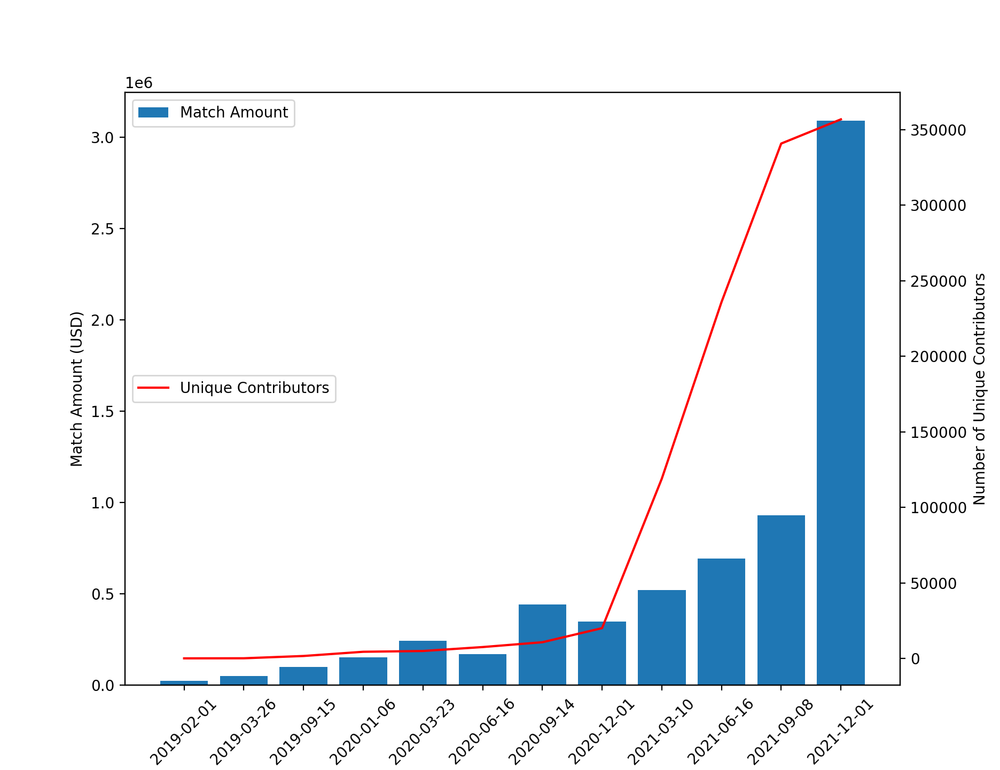
```

Figure 1 - Overview of contributors, and total matched funding provided to grants overtime in each grants round (categorised by start dates) (1-12).

From the graph above, it is obvious that the amount of attention and total matched funding that Gitcoin grants have received have increased over time. To find possible causations for this, a few other key datasets were gathered. These included search interests from Google Trends with regards to topics such as ‘gitcoin’ and ‘web3’, along with the daily close price of ETH-USD. They were collated into the excel graph seen below.

```{r}
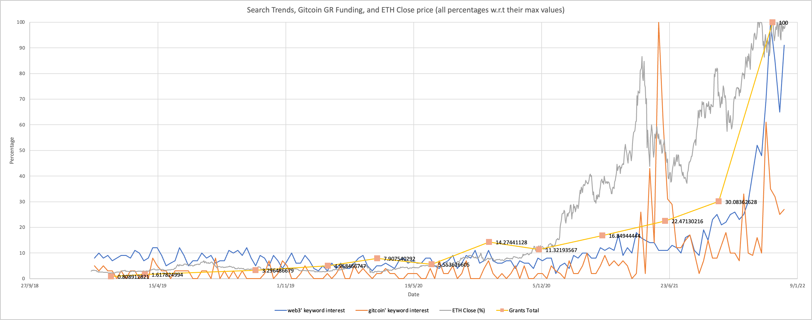
```

Figure 2 - ETH price movements alongside Gitcoin Grant matching amounts and public interest in Gitcoin and web3.

A trend that is highly apparent in the data above, is the fact that the interest for web3 has increased over time, and is also highly correlative to the market price of ETH tokens. One can reasonably assume from such a trend, that the increased interest in the Ethereum this year due to its native token’s drastic upward price movements (and the crypto market as a whole) and adoption has also been transferred over to the its vast ecosystem of Web3 projects. The total number of contributors, along with matched funding for grants in Gitcoin also follow the same trend. It is also notable to mention that, prior GR10, there was a sudden spike in interest for the platform, which may have directly contributed to the continued increase in matched funding for grants.

```{r}
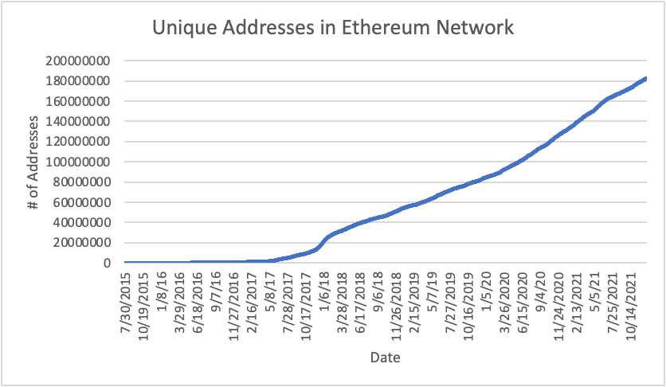
```

Figure 3 - Unique Ethereum Addresses over time, showcases the rapid adoption rate of Ethereum. (Source: Ethereum Unique Addresses Chart | Etherscan)

## Conclusion - Key Takeaways

- The attention Gitcoin, and the web3 projects which are present on the platform are receiving is increasing over time. As a result, so is the total amount of contributors and matched funding to said projects.
- The bullish state which the crypto market has retained in the past year has caused helped with the adoption rate of Ethereum increase, and as a result also helped garner more attention for web3 projects, and platforms such as Gitcoin and the grants present on the platform.

# Tburm

## Data Quality Checks

Key Findings:
- Currency fields are all stored as strings (`$XXX.XX`) and need a conversion to float values
  - `match_amount`
  - `crowdfund_amount_contributions_usd`
  - `total`
- There are null values in the `total` and `crowdfund_amount_contributions_usd` fields that should be labeled `0`
- The `region` column is not complete, with **44% of records** (2600/5900) having a value of `none` or `undefined`
  - There is not a meaningful difference between these labels, so I am combining them and coding nulls as `none`
  - Since there are so many missing values, this likely won't be useful for analysis
  
```{python}
from decimal import Decimal
from re import sub
import pandas as pd
from pandas_profiling import ProfileReport
```

```{python}
# some data cleaning functions
def parseMoney(money):
    money = Decimal(sub(r'[^\d.]', '', money))
    return money
```

```{python}
df = pd.read_csv("Grants Results History Round over Round + Grant over Grant - GR1-GR12.csv")
```

```{python}
# inspect it
df.head()
```

```{python}
df.dtypes
```

```{python}
# parse currency fields into float columns
df['match_amount'] = pd.to_numeric(df['match_amount'].str.replace('[^.0-9]', ''))
df['crowdfund_amount_contributions_usd'] = pd.to_numeric(df['crowdfund_amount_contributions_usd'].str.replace('[^.0-9]', '')).fillna(0)
df['total'] = pd.to_numeric(df['total'].str.replace('[^.0-9]', '')).fillna(0)
```

```{python}
# recode the region
df['region'] = df['region'].replace('undefined', 'none').fillna('none')
```

```{python}
df.describe()
```

```{python}
# profile the data
profile = ProfileReport(df, title="Grants Data Profile")
profile
```

```{python}
# write out the clean data
df.to_csv('grants_data_clean.csv', index=False)
```

# Grants Data Analysis

Key Findings:
- Some text

```{python}
import pandas as pd
import plotly.express as px
import plotly.graph_objects as go

import plotly.io as pio
pio.renderers.default = "notebook"
```

```{python}
# read in clean grants data
df = pd.read_csv('grants_data_clean.csv')
df['count'] = 1
df.head()
```

```{python}
# data transformation and new variables
df['dollars_per_contributor'] = df['crowdfund_amount_contributions_usd'] / df['num_unique_contributors']
```

```{python}
fig = px.histogram(
    df,
    x='round_number',
    y='round_number'
)

fig.update_layout({
    'showlegend': False,
    'title': 'Grants per Round',
    'xaxis_title': 'round',
    'yaxis_title': 'grants',
    'xaxis_dtick': 1,
    'bargap': 0.2,
})

fig.write_image("grants_per_round.jpeg")
fig.show()
```

```{python}
fig = px.histogram(
    df,
    x='round_number',
    y='num_contributions'
)

fig.update_layout({
    'showlegend': False,
    'title': 'Contributions per Round',
    'xaxis_title': 'round',
    'yaxis_title': 'contributions',
    'xaxis_dtick': 1,
    'bargap': 0.2,
})

fig.write_image("contrib_per_round.jpeg")
fig.show()
```

```{python}
fig = px.histogram(
    df,
    x='round_number',
    y=[
        'crowdfund_amount_contributions_usd',
        'match_amount'
    ]
)

fig.update_layout({
    'title': 'Contributions per Round',
    'xaxis_title': 'round',
    'yaxis_title': 'contributions ($)',
    'xaxis_dtick': 1,
    'yaxis_tickprefix': '$',
    'yaxis_tickformat': ',.0f',
    'bargap': 0.2
})

fig.write_image("contrib_per_round_match.jpeg")
fig.show()
```

## Questions:
* Holy moly round 12
  * Most recent round 12 had a huge increase in both crowdfunded contributions as well as matched contributions       
  
## Round 8
### Questions
* What happened during round 8?
  * There was a significant increase in crowdfunding contributions
  * Was this one big donation? Bigger marketing campaign?

### Key Findings
* Round 8 had a big increase in individual contribution compared to previous rounds
* The grant with the most funding in round 8 (Coin Center) had more contributions than nearly every grant in round 7 combined
* The higher total amount is driven by crowdfunding, not by a larger matched amount
* Round 8 had the lowest proportion of contributions coming from matches, so it looks more like organic growth of contributions
  * It is difficult to figure out from this dataset, since all contributions are aggregated
  * This could potentially be a single large donation
  
```{python}
fig = px.histogram(
    df,
    x='round_number',
    y='num_contributions'
)

fig.update_layout({
    'showlegend': False,
    'title': 'Contributions per Round',
    'xaxis_title': 'round',
    'yaxis_title': 'contributions',
    'xaxis_dtick': 1,
    'bargap': 0.2,
})

fig.write_image("contributions_per_round.jpeg")
fig.show()
```

```{python}
df.loc[df.round_number == 8, :].groupby('grant_title')['total'].sum(
).sort_values(ascending=False).reset_index().head(20)
```

## Round 12
### Questions
* What drove the significant increase in donations during round 12?

### Key Findings
* Both contributions and matches went up by similar amounts in this round
* Significant increase to "Community" project category
* Lots of projects in the "Grants round 12" category which seems like bad data
* Proportion of contributions coming from a match is going up, with round 12 being a local maximum
* NFT contributions almost doubled compared to round 11
* Community projects saw the largest increase compared to round 11

```{python}
df.loc[df.round_number == 12, :].groupby('grant_title')['total'].sum().sort_values(ascending=False).reset_index().head(20)
```

```{python}
df.loc[df.round_number == 12, :].groupby('grant_title')[['crowdfund_amount_contributions_usd', 'dollars_per_contributor']].sum(
).sort_values('dollars_per_contributor', ascending=False).reset_index().head(20)
```

```{python}
df_round = df.groupby('round_number')[['match_amount', 'crowdfund_amount_contributions_usd', 'total']].sum().reset_index()
df_round['match_proportion'] = df_round['match_amount'] / df_round['total']
df_round
```

```{python}
fig = px.line(
    df_round,
    x='round_number',
    y='match_proportion'
)

fig.update_layout({
    'showlegend': False,
    'title': 'Proportion of contributions from match',
    'xaxis_title': 'round',
    'yaxis_title': 'match %',
    'yaxis_tickformat': ',.0%',
    'yaxis_rangemode': 'tozero'
})

fig.write_image("proportion_from_match.jpeg")
fig.show()
```

```{python}
fig = px.histogram(
    df,
    x='round_number',
    y='crowdfund_amount_contributions_usd',
    color='category'
)

fig.update_layout({
    'title': 'Contributions by Category',
    'xaxis_title': 'round',
    'yaxis_title': 'contribution ($)',
    'bargap': 0.2,
    'yaxis_tickprefix': '$',
    'yaxis_tickformat': ',.0f',
    'yaxis_rangemode': 'tozero'
})

fig.write_image("contrib_per_category.jpeg")
fig.show()
```

```{python}
fig = px.histogram(
    df,
    x='round_number',
    y='crowdfund_amount_contributions_usd',
    color='category'
)

fig.update_layout({
    'title': 'Contributions by Category',
    'xaxis_title': 'round',
    'yaxis_title': 'contribution ($)',
    'bargap': 0.2,
    'yaxis_tickprefix': '$',
    'yaxis_tickformat': ',.0f',
    'yaxis_rangemode': 'tozero'
})

fig.write_image("contrib_per_category.jpeg")
fig.show()
```

```{python}
fig = px.histogram(
    df,
    x='round_number',
    y='count',
    color='category'
)

fig.update_layout({
    'title': 'Grants by Category',
    'xaxis_title': 'round',
    'yaxis_title': 'grants',
    'bargap': 0.2,
    'yaxis_tickformat': ',.0f',
    'yaxis_rangemode': 'tozero'
})

fig.write_image("grants_per_category.jpeg")
fig.show()
```

# ufkhan97

## 2021 Year-End Gitcoin Grants Trends 

Gitcoin grants is an innovative, principled experiment in new ways to fund open source software projects and public goods. It seeks to find new and better ways to crowdfund which rewards projects that appeal to more people rather than to merely rich people.
The main driver of this project is a system called 'quadratic funding' which is best explained at [wtfisqf.com](https://wtfisqf.com/)

Quadratic funding seeks to provide projects more funding if they have more unique contributors. In other words: more people, more money. 
Gitcoin accomplishes this by having a supply of money called a 'matching fund' for each funding cycle or grant round. Money from this matching fund is paid to grants by Gitcoin proportional to the number of unique contributors of the grant.
So far, Gitcoin has been funding projects for 3 years and in that time has had 12 rounds of funding.

## 20x in 2 years
The growth of Gitcoin grants is truly impressive! Since 2019, Gitcoin has 20x'd its impact. 20x in two years. 

Let's take a look at the numbers:


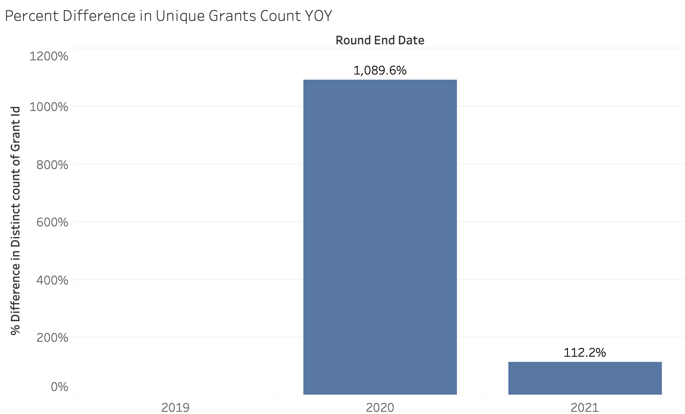

From 2019 to 2020 the number of grants 10x'd. From 2020 to 2021 the number of grants 2x'd. Put together, this is 20x in two years. I am rounding the numbers here to pick out the big trends in the gitcoin grants system. As with any system, there is immense variability if one gets increasingly granular.

This is just the number of grants on the platform, created by users. But what about the amount of **money** that was actually paid out to projects?

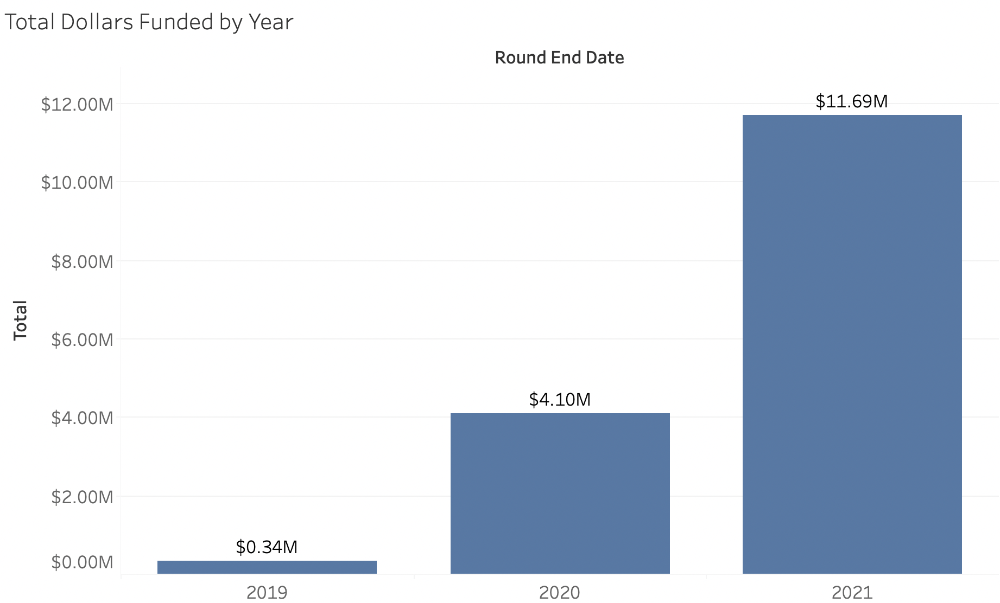
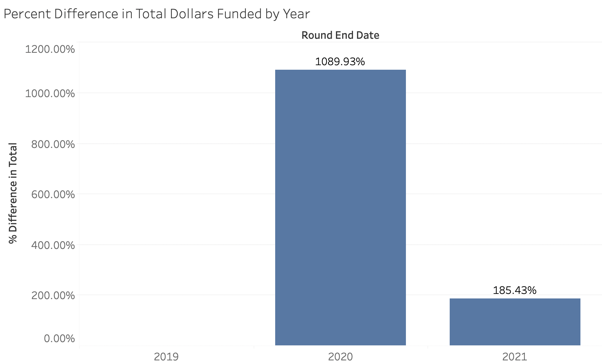

This story is even more impressive. Once again, there is roughly a 10x improvement between 2019 and 2020 (closer to 11x). There is a roughly 2x improvement between 2020 and 2021 (closer to 3x).

At *least* 20x in 2 years.

## Quadratic Funding 

Quadratic funding works through having two types of funds:
- Crowdfunded Funds (from direct contributions, just like on kickstarter or gofundme) 
- Matching Funds (from Gitcoin, based on the number of unique contributors to a grant)

How well has Quadratic Funding been working to get more money to projects that are supported by more people? The results are promising although not completely clear. 

Let's take a look at how much in funding projects recieved on Gitcoin from Crowdfunding:

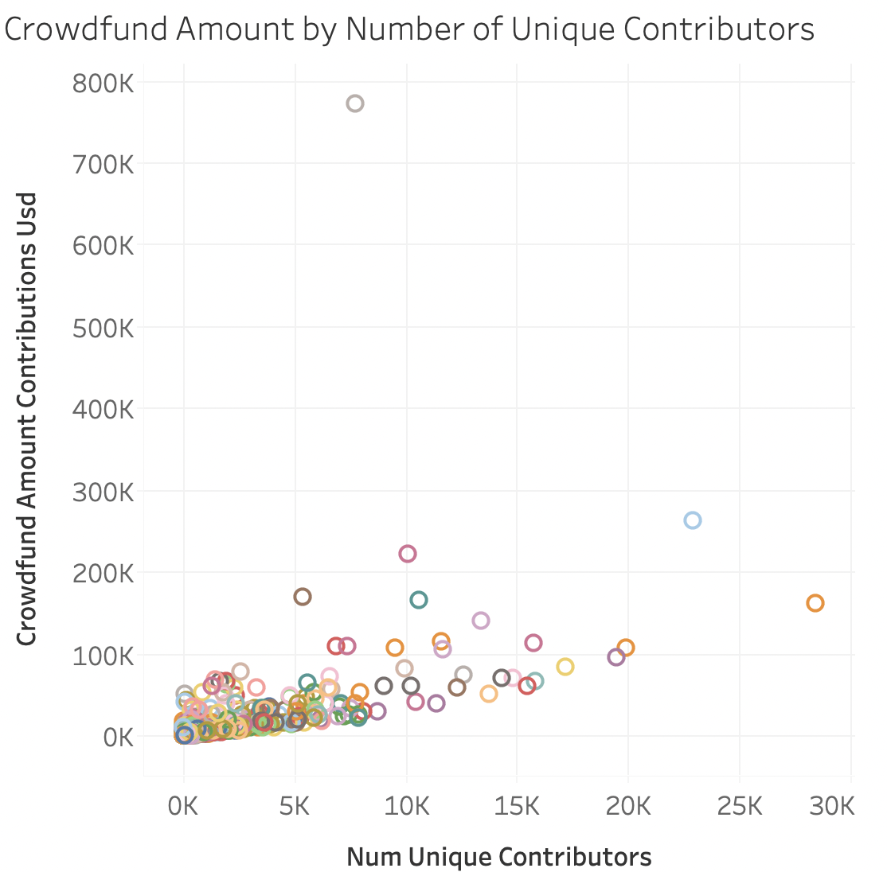

The big take-aways are that most projects recieved less than 100k in funding but a few projects recieved more. As the number of contributors increases, the amount of crowdfunding increases linearly.

Let's take a look at how much in funding projects recieved on Gitcoin from Matching Funds: 

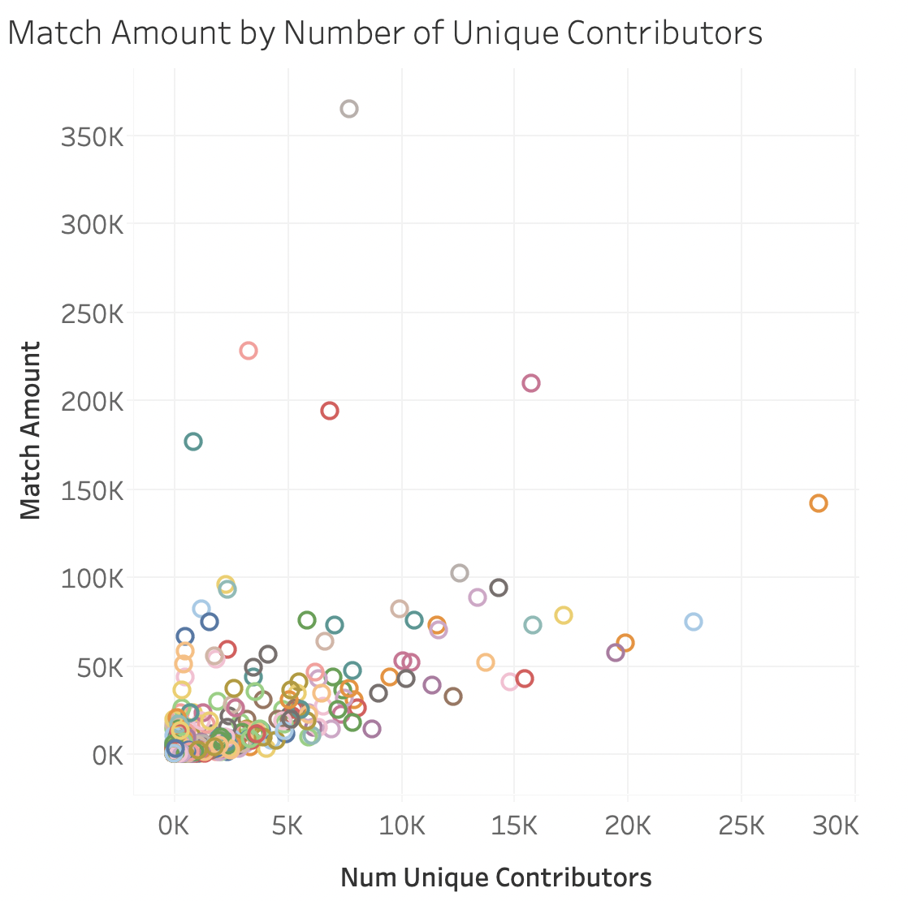

Once again, most projects recieve less than 100k in funding but a few recieved more. The points on this graph are dispersed a bit higher. If we pay particularly close attention to the bottom of the spread and scan from left to right, the trend does *not* look linear.
The trend looks exponential or *quadratic*. 

Note: Interestingly, in both graphs you'll notice a strong outlier (the gray circle at the top). This is a grant titled [Coin Center is educating policy makers about public blockchains](https://gitcoin.co/grants/1668/coin-center-is-educating-policy-makers-about-publ). The reason for it's prominence is not clear to me. 

While it is still early days for quadratic funding, the *growth* of the platform and it's implementation is truly impressive. 

## Matching Funds

As of 2021, not everyone automatically recieves matching funds. Projects which do not have enough contributors or contributions do not get matching funds. The matching funds operate like a shared communitty resource. This system may work to ensure the money is spent where the communitty wants it to be spent. 

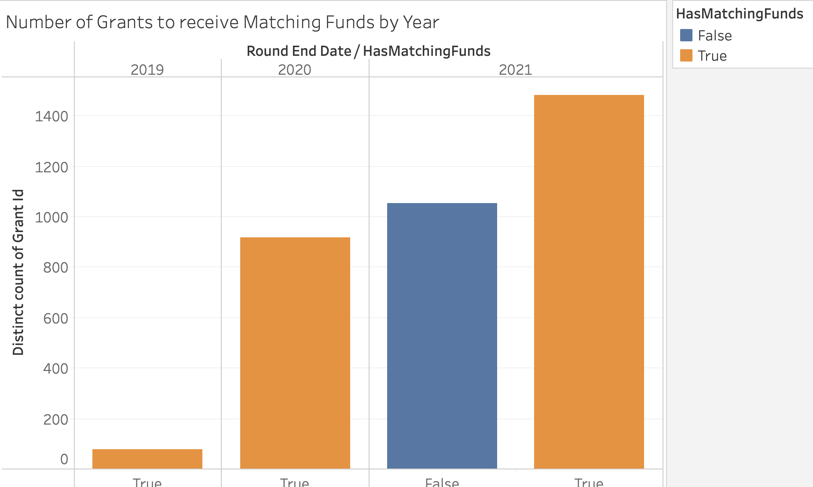

For the grants that did not recieve matching funds in 2021, what was the threshold? We can try to find a rough rule of thumb by zooming into those grants and checking how many contributors and contributions they had.

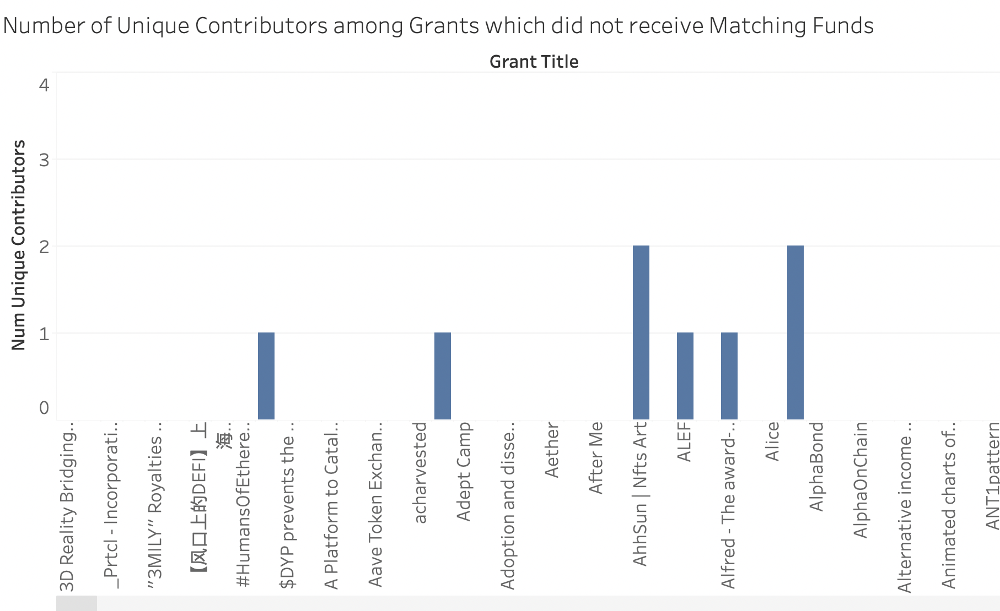
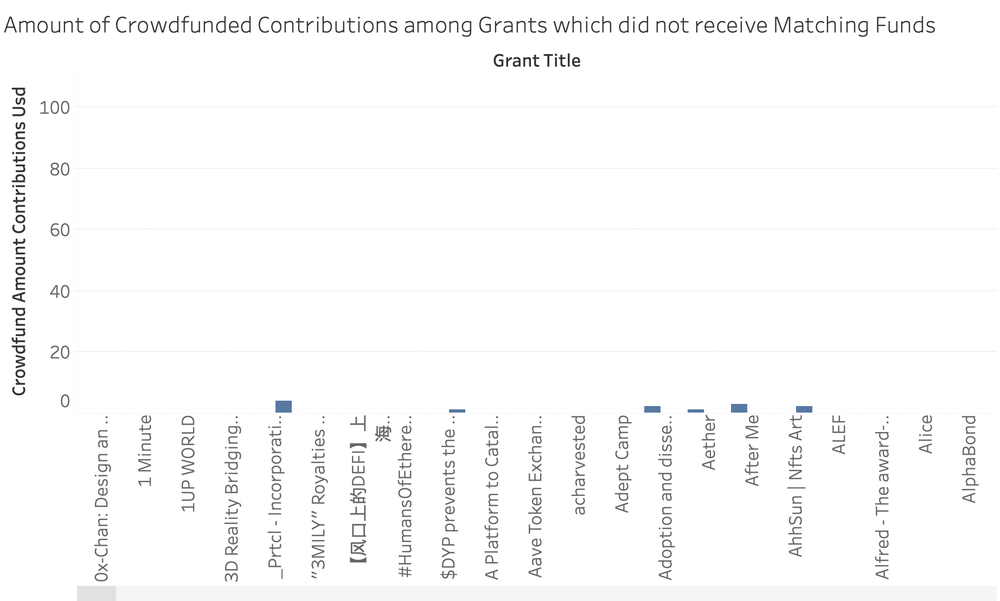

Based on these graphs, as a very general rule of thumb it seems a project should aim to have at least:
- 4+ unique contributors
- 100 USD + in crowdfunded contributions to recieve matching funds
- Note: this is a rule of thumb based on the dataset, and not a hard-coded requirement 

This opens the door to matching funds but this is only sufficient to get ones foot in the door. For example, in Gitcoin Grants Round 12 my grant submission [braid.science](https://gitcoin.co/grants/4097/braidscience) recieved $166.39 by crowdfunding from 8 contributors and an addittional $0.20 in matching funds.
On the other hand, in the same round, Coin Center raised $103,838.93 from 5727 contributors and recieved $340,000.00 in matching funds.
Also in the same round, the Electronic Frontier Foundation raised $58,715.04 from 3331 and recieved $228,273.84 in matching funds. 

The power of matching funds when applied using quadratic funding can be truly great. It serves as a mechanism to amplify popular proposals. Further, it gurantees that it is not empty popularity because the proposals which recieve matching funds must be ones people truly believe in. After all, crowdfunders had to put some of their own skin in the game: some of their own money towards the project.

# Omni Analytics Group


## Getting Started

Gitcoin is a data rich platform that is moving steadily towards leveraging its treasure trove of information in novel and interesting ways.  This analysis of the lifetime Gitcoin grants data seeks to be both comprehensive and insightful with just enough quirkiness thrown in to highlight just how interesting the analysis of this data can be.

## Grant Round Timing

First, we can visualize the active grant round periods over time.  One would expect regular intervals of time between each round, but that historically hasn't been the case.


```{r}
library(tidyverse)
library(ggthemes)
library(knitr)
library(lubridate)
library(tidytext)
library(topicmodels)
library(omnitheme)

gitcoin_grants <- read_csv("Grants Results History Round over Round + Grant over Grant - GR1-GR12.csv")

time_periods <- gitcoin_grants %>%
    distinct(round_start_date, round_end_date, .keep_all = TRUE) %>%
    arrange(round_start_date) %>%
    mutate(year = year(round_start_date),
           fake = ymd(paste("2022", month(round_start_date), day(round_start_date), sep = "-")),
           fake_end = ymd(paste("2022", month(round_end_date), day(round_end_date), sep = "-")))


ggplot(data = time_periods, aes(xmin = round_start_date, xmax = round_end_date, fill = factor(round_number))) +
    geom_rect(ymin = 0, ymax = 1, colour = "grey60") +
    geom_label(aes(label = paste0("#", round_number), x = round_start_date, y = .5)) +
    scale_fill_brewer(palette = "Set3") +
    scale_x_date(date_breaks = "3 months", date_labels = "%b %Y") +
    labs(
        title = "Active Periods for each Gitcoin Grants Round",
        subtitle = "Periods colored by round number"
    ) +
    theme_fivethirtyeight() +
    theme(legend.position = "off", axis.text.y = element_blank()) +
    watermark_img(filename = "omnianalytics/gc.png", location = "center", width = 300, alpha = 0.2)

time_periods %>%
    select(Round = round_number, `Start Date` = round_start_date, `End Date` = round_end_date) %>%
    kable()

```

We can make this more clear by stacking each year vertically, which indicates that the grant rounds both occurred at different times during the year, and lasted for different amounts of time with 2020 being one of the busiest years.

```{r, fig.width=14}
ggplot(data = time_periods, aes(xmin = fake, xmax = fake_end, fill = factor(round_number))) +
    geom_rect(ymin = 0, ymax = 1, colour = "grey60") +
    geom_label(aes(label = paste0("#", round_number), x = fake, y = .5)) +
    scale_fill_brewer(palette = "Set3") +
    scale_x_date(date_breaks = "2 weeks", date_labels = "%b %d") +
    facet_wrap(~year, nrow = 4) +
    labs(
        title = "Active Periods for each Gitcoin Grants Round",
        subtitle = "Periods colored by round number"
    ) +
    theme_fivethirtyeight() +
    theme(legend.position = "off", axis.text.y = element_blank())
```


## Text Analysis on Grant Titles

With a little bit of text analysis we can better understand the types of grants that are hosted on the site by categorizing them according to their titles. Here we've performed a Latent Dirichlet Allocation algorithm on the grant titles, after performing some basic text cleaning operations. We selected six themes for the analysis. Below we can see the top terms that fell into each of the six categories.

Roughly speaking, the categories obtained for the grants are as follows:

1. DeFi - Grants associated with Decentralized Finance
2. Blockchain/Crypto - General blockchain development projects
3. Panvala League - Grants associated with the Panvala shared endowment
4. DAO and Community - Grants seeking to build a community or DAO
5. Insights and Media Awareness - Grants involving dashboards and social media awareness for the project
6. NFTs - Grants related to NFTs

```{r}
title_tdm1 <- gitcoin_grants %>%
    select(grant_id, grant_title) %>%
    unnest_tokens("word", grant_title) %>%
    anti_join(get_stopwords()) %>%
    group_by(grant_id, word) %>%
    add_tally() 
title_tdm <- title_tdm1 %>%
    cast_tdm(grant_id, word, n)

my_lda <- LDA(title_tdm, k = 6, control = list(seed = 1234))
tidy_lda <- tidy(my_lda, matrix = "beta")

tidy_lda %>%
    group_by(topic) %>%
    slice_max(beta, n = 10) %>% 
    ungroup() %>%
    arrange(topic, -beta) %>%
    mutate(term = reorder_within(term, beta, topic)) %>%
    ggplot(aes(beta, term, fill = factor(topic))) +
    geom_col(show.legend = FALSE) +
    facet_wrap(~ topic, scales = "free") +
    scale_fill_brewer(palette = "Dark2") +
    scale_y_reordered() +
    labs(
        title = "Gitcoin Grant Themes in Grant Titles",
        subtitle = "Through Gitcoin Grants Round 12"
    )
```


A fun exercise is to look at the amount of money raised by projects with specific words in their descriptions. Not surprisingly the word "blockchains" was used in quite often and the total amount raised by grants with that in the title amounted to  	$6,984,782 across all rounds. Other popular words with donors were "policy", "makers", "privacy", and "accounting".

## Top 30 words by total amount raised

```{r}
title_tdm1 %>%
    left_join(gitcoin_grants %>% select(grant_id, total)) %>%
    mutate(total = readr::parse_number(total)) %>%
    group_by(word) %>%
    summarise(total = sum(total)) %>%
    arrange(desc(total)) %>%
    mutate(total = scales::dollar(total)) %>%
    slice(1:30) %>%
    kable()
```

An slightly deeper analysis normalizing for the word frequency could further unearth other specific words that resonate with Gitcoin donors enough for them to donate heavily to grants with those keywords. An even more interesting follow up would be to see how the previously derived topic-model based categories have changed over time across rounds. This could answer questions like: Have there been more or fewer social awareness grants? or When did NFT related grants become popular?

## Distributions and Spreads

We now want to look at how the monetary contributions are spread out by contributions, the number of unique contributors and matching funds. The most unsurprising results we see is that the most common contribution is indeed \$1 and was, by far, the amount that appeared most frequently in the data.  On average donors gave somewhere between \$100 and \$500 as indicated by the vertical line. At the skew we see about some contributions totaling more than \$10,000. Across the rounds you can see not only the total volume increasing, but the average donation moving upward overtime.

```{r}
ggplot(data = gitcoin_grants, aes(x = num_contributions)) +
    geom_histogram(colour = "grey60", fill = "purple2") +
    geom_vline(xintercept = mean(gitcoin_grants$num_contributions), colour = "orange1") +
    scale_x_log10(labels = scales::dollar, breaks = 10^(-2:10)) +
    scale_y_continuous(breaks = scales::pretty_breaks(n = 10),
                       labels = scales::comma) +
    labs(
        title = "Distribution of Contributions (Log Scale - $)",
        subtitle = "Through Gitcoin Grants Round 12",
    ) +
    theme_fivethirtyeight() +
    watermark_img(filename = "omnianalytics/gc.png", location = "center", width = 300, alpha = 0.2)
```
What's cool about looking at the number of unique contributors is the fact that we see most grants get more than 1 donor, even the smaller grants. 
```{r}
dat2 <- gitcoin_grants %>% group_by(round_number) %>% summarise(avg = mean(num_contributions, na.rm = TRUE))

ggplot(data = gitcoin_grants, aes(x = num_contributions)) +
    geom_histogram(colour = "grey60", fill = "purple2") +
    geom_vline(data = dat2, aes(xintercept = avg), colour = "orange1") +
    scale_x_log10(labels = scales::dollar, breaks = 10^(-2:10)) +
    scale_y_continuous(breaks = scales::pretty_breaks(n = 10),
                       labels = scales::comma) +
    facet_wrap(~round_number) +
    labs(
        title = "Distribution of Contributions by Round (Log Scale - $)",
        subtitle = "Through Gitcoin Grants Round 12",
    ) +
    theme_fivethirtyeight()
```


```{r}
ggplot(data = gitcoin_grants, aes(x = num_unique_contributors)) +
    geom_histogram(colour = "grey60", fill = "purple2") +
    geom_vline(xintercept = mean(gitcoin_grants$num_unique_contributors), colour = "orange1") +
    scale_x_log10(labels = scales::comma, breaks = 10^(-2:10)) +
    scale_y_continuous(breaks = scales::pretty_breaks(n = 10),
                       labels = scales::comma) +
    labs(
        title = "Distribution of Unique Contributors (Log Scale)",
        subtitle = "Through Gitcoin Grants Round 12",
    ) +
    theme_fivethirtyeight()
```

```{r}
dat2 <- gitcoin_grants %>% group_by(round_number) %>% summarise(avg = mean(num_unique_contributors, na.rm = TRUE))

ggplot(data = gitcoin_grants, aes(x = num_unique_contributors)) +
    geom_histogram(colour = "grey60", fill = "purple2") +
    geom_vline(data = dat2, aes(xintercept = avg), colour = "orange1") +    
    scale_x_log10(labels = scales::comma, breaks = 10^(-2:10)) +
    scale_y_continuous(breaks = scales::pretty_breaks(n = 10),
                       labels = scales::comma) +
    facet_wrap(~round_number) +
    labs(
        title = "Distribution of Unique Contributors by Round (Log Scale)",
        subtitle = "Through Gitcoin Grants Round 12",
    ) +
    theme_fivethirtyeight()
```

For the match amount, on average, successful grants receive about \$1000 in additional funds from the pool. This amount has been relatively consistent overtime.

```{r}
dat <- gitcoin_grants %>% mutate(match_amount = readr::parse_number(match_amount))

ggplot(data = dat, aes(x = match_amount)) +
    geom_histogram(colour = "grey60", fill = "purple2") +
    geom_vline(xintercept = mean(dat$match_amount), colour = "orange1") +
    scale_x_log10(labels = scales::dollar, breaks = 10^(-2:10)) +
    scale_y_continuous(breaks = scales::pretty_breaks(n = 10),
                       labels = scales::comma) +
    labs(
        title = "Distribution of Match Amount (Log Scale - $)",
        subtitle = "Through Gitcoin Grants Round 12",
    ) +
    theme_fivethirtyeight()
```

```{r, fig.width=22}
dat <- gitcoin_grants %>% mutate(match_amount = readr::parse_number(match_amount))
dat2 <- dat %>% group_by(round_number) %>% summarise(avg = mean(match_amount, na.rm = TRUE))

ggplot(data = dat, aes(x = match_amount)) +
    geom_histogram(colour = "grey60", fill = "purple2") +
    geom_vline(data = dat2, aes(xintercept = avg), colour = "orange1") +
    scale_x_log10(labels = function(.) paste0("$", scales::comma(., accuracy = 1)), breaks = 10^(-2:10)) +
    scale_y_continuous(breaks = scales::pretty_breaks(n = 10),
                       labels = scales::comma) +
    facet_wrap(~round_number) +
    labs(
        title = "Distribution of Match Amount by Round (Log Scale - $)",
        subtitle = "Through Gitcoin Grants Round 12",
    ) +
    theme_fivethirtyeight()
```


Next, we take a look at the number of grants by region. Grants that are not associated with a particular region are the plurality, followed by North America and Europe. The least commonly associated regions for grants were the Middle East and Oceania.

```{r}
# Number of grants per region total and over time
gitcoin_grants %>%
    mutate(region = ifelse(region %in% c("none", "undefined", "null"), "none", region)) %>%
    group_by(region) %>%
    summarise(grants = n()) %>%
    arrange(desc(grants)) %>%
    kable()
```

With that said, the aggregate view doesn't demonstrate how these values have changed over time. When we break that down, we see a noticeable recent growth across all regions, with a particularly sharp recent increase for East Asia and Southeast Asia. 

```{r}
gitcoin_grants %>%
    mutate(region = ifelse(region %in% c("none", "undefined", "null"), "none", region)) %>%
    group_by(month = month(round_start_date), year = year(round_start_date), region) %>%
    summarise(grants = n()) %>%
    mutate(Date = ymd(paste(year, month, "01", sep = "-"))) %>%
    ggplot(aes(x = Date, y = grants, colour = region)) +
    geom_line(size = 1.5) +
    scale_color_brewer(palette = "Set3") +
    scale_x_date(date_breaks = "3 months", date_labels = "%b %y") +
    scale_y_continuous(breaks = scales::pretty_breaks(n = 10)) +
    labs(
        title = "Number of Grants over Time by Region",
        subtitle = "Through Gitcoin Grants Round 12"
    ) +
    theme_fivethirtyeight() +
    watermark_img(filename = "omnianalytics/gc.png", location = "center", width = 300, alpha = 0.2)
```

We can further break this down by faceting by grant category. We quickly see that the growth across regions is not uniform by category. For example, Community grants appear to be growing faster for Southeast Asia than are other grant categories.

```{r, fig.height=20}
# Number of grants per region per category in total and overtime
gitcoin_grants %>%
    mutate(region = ifelse(region %in% c("none", "undefined", "null"), "none", region)) %>%
    group_by(month = month(round_start_date), year = year(round_start_date), region, category) %>%
    summarise(grants = n()) %>%
    mutate(Date = ymd(paste(year, month, "01", sep = "-"))) %>%
    ggplot(aes(x = Date, y = grants, colour = region)) +
    geom_line(size = 1.5) +
    scale_color_brewer(palette = "Set3") +
    scale_x_date(date_breaks = "3 months", date_labels = "%b %y") +
    scale_y_continuous(breaks = scales::pretty_breaks(n = 10)) +
    facet_wrap(~category, ncol = 1) +
    labs(
        title = "Number of Grants over Time by Region and Category",
        subtitle = "Through Gitcoin Grants Round 12"
    ) +
    theme_fivethirtyeight()
```

Next, let's look at contributors by region. Once again, no region, North America, and Europe dominate the list. However, there are some differences towards the bottom. For example, despite Oceania having the fewest number of total grants, it only has the third fewest contributors, suggesting that their grants have attracted a high level of interest in that region.

```{r}
# Number of contributors per region in total and over time
gitcoin_grants %>%
    mutate(region = ifelse(region %in% c("none", "undefined", "null"), "none", region)) %>%
    group_by(region) %>%
    summarise(contributors = sum(num_unique_contributors)) %>%
    arrange(desc(contributors)) %>%
    kable()
```

Once again, we can visualize this as a function of time. We see a drastic increase in the number of contributors associated with grants for Europe and East Asia, with a relative decline for grants that aren't associated with a region.

```{r}
gitcoin_grants %>%
    mutate(region = ifelse(region %in% c("none", "undefined", "null"), "none", region)) %>%
    group_by(month = month(round_start_date), year = year(round_start_date), region) %>%
    summarise(contributors = sum(num_unique_contributors)) %>%
    mutate(Date = ymd(paste(year, month, "01", sep = "-"))) %>%
    ggplot(aes(x = Date, y = contributors, colour = region)) +
    geom_line(size = 1.5) +
    scale_color_brewer(palette = "Set3") +
    scale_x_date(date_breaks = "3 months", date_labels = "%b %y") +
    scale_y_continuous(breaks = scales::pretty_breaks(n = 10),
                       labels = scales::comma) +
    labs(
        title = "Number of Unique Contributors over Time by Region",
        subtitle = "Through Gitcoin Grants Round 12"
    ) +
    theme_fivethirtyeight() +
    watermark_img(filename = "omnianalytics/gc.png", location = "center", width = 300, alpha = 0.2)
```

Next, we can look at the total crowd-funded contributions by region, which largely tells the same story. Interestingly, once again Oceania has a relatively higher amount of contributions when compared to the number of grants for that region.

```{r}
# Total crowdfunded contributions per region
gitcoin_grants %>%
    mutate(region = ifelse(region %in% c("none", "undefined", "null"), "none", region),
           crowdfund_amount_contributions_usd = readr::parse_number(crowdfund_amount_contributions_usd)) %>%
    group_by(region) %>%
    summarise(contributions = sum(crowdfund_amount_contributions_usd, na.rm = TRUE)) %>%
    arrange(desc(contributions)) %>%
    mutate(contributions = scales::dollar(contributions)) %>%
    kable()
```

We can also visualize the top 10 grants per region, and the round associated, based on the total crowd-funded amount. Plenty to see in this table, but one previous finding is given some support - it appears the Lighthouse Ethereum 2.0 Client is a reason for the Oceania values being higher in terms of amount of contributors while lesser in terms of the total number.

```{r}
# Top 10 grants per region
gitcoin_grants %>%
    mutate(region = ifelse(region %in% c("none", "undefined", "null"), "none", region),
           crowdfund_amount_contributions_usd = readr::parse_number(crowdfund_amount_contributions_usd)) %>%
    group_by(region) %>%
    arrange(desc(crowdfund_amount_contributions_usd)) %>%
    slice(1:10) %>%
    mutate(contributions = scales::dollar(crowdfund_amount_contributions_usd)) %>%
    select(Region = region, Round = round_number, Grant = grant_title, Amount = contributions) %>%
    kable()
```

Next we turn to an aggregate view of grants by category, which indicates the most popular grant categories are Community and dApp Tech. 

```{r}
# Number of grants per category total and over time
gitcoin_grants %>%
    group_by(category) %>%
    summarise(grants = n()) %>%
    arrange(desc(grants)) %>%
    kable()
```

As a function of time, it is clear that these two categories have long been popular, but their relative popularity has accelerated in recent months.

```{r}
gitcoin_grants %>%
    group_by(month = month(round_start_date), year = year(round_start_date), category) %>%
    summarise(grants = n()) %>%
    mutate(Date = ymd(paste(year, month, "01", sep = "-"))) %>%
    ggplot(aes(x = Date, y = grants, colour = category)) +
    geom_line(size = 1.5) +
    scale_color_brewer(palette = "Set3") +
    scale_x_date(date_breaks = "3 months", date_labels = "%b %y") +
    scale_y_continuous(breaks = scales::pretty_breaks(n = 10)) +
    labs(
        title = "Number of Grants over Time by Category",
        subtitle = "Through Gitcoin Grants Round 12"
    ) +
    theme_fivethirtyeight() +
    watermark_img(filename = "omnianalytics/gc.png", location = "center", width = 300, alpha = 0.2)
```

Despite Community being overall the top category, contributors appear more likely to gravitate towards grants that are either dApp Tech or Infra Tech.

```{r}
# Number of contributors per category in total and over time
gitcoin_grants %>%
    group_by(category) %>%
    summarise(contributors = sum(num_unique_contributors)) %>%
    arrange(desc(contributors)) %>%
    kable()
```

With that said, as can be seen by the below chart, in the most recent months there has been an acceleration in the number of unique contributors to Community grants in recent months.

```{r}
gitcoin_grants %>%
    group_by(month = month(round_start_date), year = year(round_start_date), category) %>%
    summarise(contributors = sum(num_unique_contributors)) %>%
    mutate(Date = ymd(paste(year, month, "01", sep = "-"))) %>%
    ggplot(aes(x = Date, y = contributors, colour = category)) +
    geom_line(size = 1.5) +
    scale_color_brewer(palette = "Set3") +
    scale_x_date(date_breaks = "3 months", date_labels = "%b %y") +
    scale_y_continuous(breaks = scales::pretty_breaks(n = 10),
                       labels = scales::comma) +
    labs(
        title = "Number of Unique Contributors over Time by Category",
        subtitle = "Through Gitcoin Grants Round 12"
    ) +
    theme_fivethirtyeight() +
    watermark_img(filename = "omnianalytics/gc.png", location = "center", width = 300, alpha = 0.2)
```

Looking at the popularity of categories in terms of total crowd-funded contributions, we see a similar pattern, although Infra Tech projects have had nearly as much funded as have dApp Tech and Community projects, despite less than half the total number of grants.

```{r}
# Total crowdfunded contributions per category
gitcoin_grants %>%
    mutate(crowdfund_amount_contributions_usd = readr::parse_number(crowdfund_amount_contributions_usd)) %>%
    group_by(category) %>%
    summarise(contributions = sum(crowdfund_amount_contributions_usd, na.rm = TRUE)) %>%
    arrange(desc(contributions)) %>%
    mutate(contributions = scales::dollar(contributions)) %>%
    kable()
```

We can explore the top grants by category and round to see that certain projects have an outsized influence on the category in terms of the amount funded, such as the Coin Center grant under the Community category.

```{r}
# Top 10 grants per category
gitcoin_grants %>%
    mutate(crowdfund_amount_contributions_usd = readr::parse_number(crowdfund_amount_contributions_usd)) %>%
    group_by(category) %>%
    arrange(desc(crowdfund_amount_contributions_usd)) %>%
    slice(1:10) %>%
    mutate(contributions = scales::dollar(crowdfund_amount_contributions_usd)) %>%
    select(Category = category, Round = round_number, Grant = grant_title, Amount = contributions) %>%
    kable()
```
## Bonus Application 

You really read down this far? That means you are interested in learning more!  Maybe seeing specific trends on donations for intdividual grants? As a prize for your diligence and curiosity, please take a look at our app hosted here:  https://crypto.omnianalytics.io/apps/gitcoin-grants-lifetime-analysis/

# Snowdot

{width=100% height=400}

# lljxx1 

{width=100% height=400}

# SamixDev

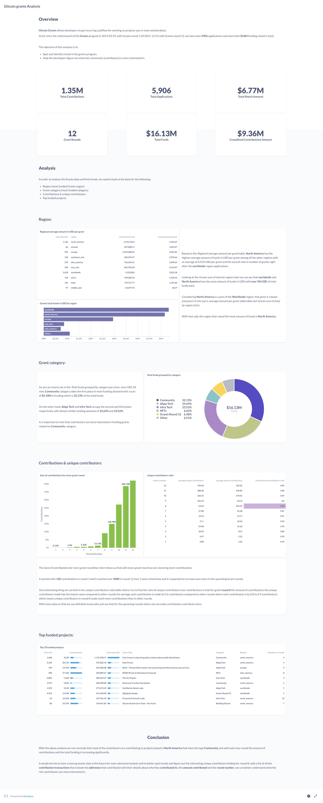